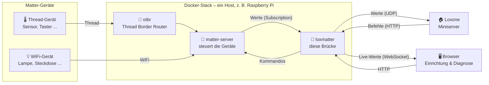

#  loxmatter


Bindet Matter-Geräte (Thread und WiFi) an einen Loxone Miniserver an —
selbst gehostet, ohne Cloud.

Design: [`docs/superpowers/specs/2026-09-01-matter-loxone-bridge-design.md`](docs/superpowers/specs/2026-09-01-matter-loxone-bridge-design.md)

## Inhalt

- [Was macht loxmatter?](#was-macht-loxmatter)
- [Stand](#stand)
- [Voraussetzungen](#voraussetzungen)
- [Erste Schritte](#erste-schritte)
- [Entwickeln](#entwickeln)
- [Ein Gerät ansehen](#ein-gerät-ansehen)
- [Dauerhaft betreiben: `loxmatter run`](#dauerhaft-betreiben-loxmatter-run)
- [Lizenz](#lizenz)

## Was macht loxmatter?

Matter-Geräte (Lampen, Steckdosen, Sensoren, Taster …) und ein Loxone
Miniserver sprechen von Haus aus nicht miteinander. loxmatter sitzt
dazwischen: Es liest jeden Wert, den ein Matter-Gerät liefert — inklusive
Ereignissen wie Tastendrücken — und reicht ihn an den Miniserver weiter, und
umgekehrt setzt es Befehle aus Loxone in Matter-Kommandos um. Geräte werden
über eine Weboberfläche eingelernt; die passenden Loxone-Objekte entstehen
als fertige Vorlagendatei zum Import in Loxone Config, nicht per Handarbeit.



Kein Profil pro Gerätetyp: loxmatter liest den Endpoint-/Cluster-Baum eines
Geräts generisch aus, statt eine kuratierte Liste unterstützter Geräte zu
pflegen. Neue Geräte funktionieren dadurch am ersten Tag, auch ohne dass
loxmatter sie kennt.

## Stand

Phasen 1 und 3 bis 6 sind gebaut: Matter-Adapter und Signal-Extraktion,
Vorlagen-Export, die Laufzeitstrecke zwischen Matter und Loxone, die
Bedienoberfläche samt Zugangsschutz und die Signalauswahl. Phase 2 wurde
übersprungen. Validiert gegen zwei reale IKEA-Geräte an einem laufenden
matter-server (Testumgebung: [`deploy/testhost/`](deploy/testhost/)); der
Dienst läuft dort als Container.

**Noch offen:** der Durchstich gegen einen echten Loxone Miniserver — die
erzeugten Vorlagen sind bisher nur gegen einen nachgebauten Miniserver
geprüft, nicht in Loxone Config importiert.

Aus der Validierung von Phase 1: für Attribute trägt die generische
Zerlegung uneingeschränkt — jeder Attributpfad war parsebar, kein gelistetes
Attribut fehlte. Für Events trug sie nicht: keins der beiden Geräte führt die
`EventList`, deshalb ist die Event-Erkennung FeatureMap-basiert und
Cluster-spezifisch (`discovery.FEATURE_MAP_EVENTS`). Details, Zahlen und die
Konsequenzen stehen im Validierungsabschnitt der Spec,
[Abschnitt 3.5](docs/superpowers/specs/2026-09-01-matter-loxone-bridge-design.md#35-abbildung-generisch-statt-kuratiert).

## Voraussetzungen

**Software**

- [Docker](https://docs.docker.com/get-docker/) mit Compose-Plugin — für den
  vollständigen Stack (empfohlen für den eigenen Betrieb)
- oder, wer nur die Kommandozeile ohne Container nutzen will: Python 3.12+
  und [`uv`](https://docs.astral.sh/uv/getting-started/installation/)
- Git

**Hardware**

- Ein Loxone Miniserver im selben Netzwerk wie der Rechner, auf dem loxmatter
  läuft
- Ein Host, auf dem der Dienst dauerhaft läuft — z. B. ein Raspberry Pi 4 im
  selben Netz wie Miniserver und Geräte (die Testumgebung dieses Projekts
  läuft so, siehe [`deploy/testhost/`](deploy/testhost/))
- Nur für **Thread**-Geräte: ein USB-Funkmodul als Thread-Funkadapter (z. B.
  SONOFF Dongle Plus MG24) am Host — der Docker-Stack bringt dafür einen
  eigenen OpenThread Border Router mit
- Ein Bluetooth-Adapter am Host, für das Einlernen von Geräten per BLE
  (Matter-Commissioning)

Kein Vorwissen über Matter oder Thread nötig — der Docker-Stack bringt die
komplette Matter-Steuerung (`matter-server`) und den Thread-Border-Router
(`otbr`) bereits mit.

## Erste Schritte

### Schnell reinschnuppern, ohne Hardware

Zeigt, wie loxmatter ein Gerät liest — läuft komplett gegen ein
gespeichertes Beispiel-Gerät, ohne Netzwerk oder echte Hardware:

```bash
git clone git@github.com:lucienkerl/loxmatter.git
cd loxmatter
uv sync
uv run pytest                                                    # Testsuite, ohne Hardware
uv run loxmatter inspect --fixture tests/fixtures/nodes/example_light.json
```

Siehe [Ein Gerät ansehen](#ein-gerät-ansehen) für mehr dazu.

### Eigene Umgebung aufsetzen (mit echter Hardware)

1. Repository auf dem Host klonen, der dauerhaft laufen soll:

   ```bash
   git clone git@github.com:lucienkerl/loxmatter.git
   cd loxmatter/deploy/testhost
   ```

2. `.env` aus der Vorlage anlegen und ausfüllen (Funkadapter, Bluetooth,
   IP des Miniservers):

   ```bash
   cp .env.example .env
   ```

   Details zu jeder Variable stehen als Kommentar in
   [`.env.example`](deploy/testhost/.env.example).

3. Stack starten:

   ```bash
   docker compose up -d --build
   ```

   Das baut und startet drei Container: `otbr` (Thread-Netz), `matter-server`
   (Matter-Steuerung) und `loxmatter` (diese Brücke).

4. Im Browser `http://<Host>:8080/` öffnen. Beim allerersten Aufruf zeigt
   die Oberfläche eine Ersteinrichtung — ein Passwort vergeben, siehe
   [Zugangsschutz](#dauerhaft-betreiben-loxmatter-run) unten.

5. In der Weboberfläche ein Gerät einlernen, ansehen und die Vorlage
   exportieren (`VIU_*.xml`, `VO_*.xml`). Diese Dateien in Loxone Config
   importieren und die entstandenen Ein-/Ausgänge auf die gewünschten
   Funktionsbausteine ziehen — das bleibt Handarbeit, aber pro Gerät nur
   einmal.

> **Hinweis:** [`deploy/testhost/`](deploy/testhost/) ist die Umgebung, gegen
> die dieses Projekt bisher getestet wurde — kein gehärtetes
> Produktions-Image (nicht-root-Nutzer, gepinnte Digests, o. Ä. sind noch
> offen). Für den Hausgebrauch heute trotzdem der geradlinigste Weg; die
> Sicherheitshinweise unter [Dauerhaft betreiben](#dauerhaft-betreiben-loxmatter-run)
> gelten unverändert.

## Entwickeln

```bash
uv sync
uv run pytest
```

Die Testsuite läuft ohne Hardware und ohne Netzwerkzugriff.

## Ein Gerät ansehen

```bash
uv run loxmatter inspect --fixture tests/fixtures/nodes/example_light.json
uv run loxmatter inspect --node 12          # gegen laufenden matter-server
```

Der erste Aufruf funktioniert heute ohne weitere Vorbereitung. Der zweite
braucht einen erreichbaren matter-server (Standardadresse
`ws://localhost:5580/ws`, per `--url` änderbar) — läuft und wurde gegen
echte Hardware erprobt, siehe [`deploy/testhost/`](deploy/testhost/) für die
Testumgebung.

## Dauerhaft betreiben: `loxmatter run`

```bash
uv run loxmatter run --miniserver 192.168.1.10
```

Verbindet dauerhaft mit matter-server und Miniserver und startet einen
HTTP-Dienst (Standardport 8080, `--listen`), der zwei Dinge gleichzeitig
ausliefert:

- `/cmd` und `/resync` für den Miniserver (virtuelle Ausgänge) — unverändert
  seit Phase 4.
- `/` und `/api/*` für eine Bedienoberfläche im Browser: Geräte einlernen,
  ansehen, benennen, schalten, Vorlagen exportieren, Diagnose.

**Die Ansicht „System"** zeigt seit dem Live-Feed (2026-09-03) drei Ströme
laufend statt nur auf Knopfdruck: Logzeilen, UDP-Mitschnitt und Kommando-Log.
Die Logzeilen sind dieselben, die auch `docker logs` zeigt — nur ohne
Shell-Zugriff auf den Host, ab Stufe INFO. Ein Klick auf „Pausieren" hält die
Anzeige an, ohne die laufende Erfassung zu stoppen; „Heartbeat und Resend
ausblenden" filtert nur die Anzeige, nicht was ankommt. Details:
[Live-Feed-Entwurf](docs/superpowers/specs/2026-09-03-diagnose-livefeed-design.md).

**Was eine exportierte Vorlage standardmäßig enthält.** Ein Gerät liefert oft
weit mehr Signale, als jemand in Loxone haben will — eine Steckdose etwa über
hundert, meist Thread-Funkzähler, Seriennummern und andere Verwaltungswerte.
Der Export nimmt deshalb standardmäßig nur die **funktionalen** Signale
mit — die, die zum erkannten Gerätetyp gehören (bei einer Steckdose: Ein/Aus,
Spannung, Strom, Leistung, Verbrauch). Alles andere bleibt technisch
exportierbar, ist aber nicht angehakt. In der Signalliste der WebUI stehen
diese übrigen Signale im zugeklappten Block „Experte" (mit Anzahl in der
Überschrift) — jedes davon trägt seinen eigenen Exportieren-Haken und lässt
sich dort einzeln aktivieren, etwa ein Thread-Zähler zur Fehlersuche.
Begründung und Auswahlregel: [Signalauswahl-Entwurf](docs/superpowers/specs/2026-09-03-signalauswahl-design.md).

**Projektdatei-Sync (`POST /api/export/project-sync`, WebUI oben unter
„Export" — inzwischen der empfohlene Weg vor den einzeln zu importierenden
Vorlagendateien darunter).** Statt Vorlagen einzeln zu importieren, kann eine
bestehende Loxone-Projektdatei hochgeladen werden — das Tool gleicht sie gegen
die gespeicherten Geräte ab und liefert eine gepatchte Fassung zum Download.
Updates an bereits bestehenden virtuellen Ein-/Ausgängen und neue Signale
innerhalb bereits bestehender Geräte sind die Vorgabe. **Komplett neue
Geräte-Container sind experimentell** und nur über einen expliziten Haken
im WebUI enthalten: das dafür nötige ID-Schema für neue Objekte ist aus
einer einzigen echten Projektdatei abgeleitet, nicht offiziell dokumentiert
und **nicht verifiziert**. Hatte das Projekt noch nie einen virtuellen
Ein- bzw. Ausgang dieser Art (kein `VirtualInCaption`/`VirtualOutCaption`-
Abschnitt), legt derselbe experimentelle Pfad diesen Abschnitt inzwischen
automatisch mit an, statt den Haken zu sperren — kein manuelles Vorbereiten
in Loxone Config mehr nötig, aber ein weiteres unverifiziertes Objekt mehr in
der Kette. Vor dem ersten Vertrauen in diesen Pfad: eine damit gepatchte
Datei einmal in Loxone Config öffnen und auf Fehler prüfen.
Details: [Projektdatei-Sync-Entwurf](docs/superpowers/specs/2026-09-03-projektdatei-sync-design.md).

**Achtung beim Update auf diese Fassung, wenn schon Geräte eingelernt
sind.** Der Einmal-Umzug der Datenbank auf dieses Schema setzt den
Exportieren-Haken **jedes** bereits gespeicherten Signals auf den neuen
Vorgabewert zurück – auch wenn er zuvor von Hand umgelegt wurde. Wer vor
diesem Update z. B. Thread-Zähler gezielt freigeschaltet oder ein Signal
abgeschaltet hat, verliert diese Auswahl beim ersten Start danach, ohne
Warnung, und muss sie in der Signalliste erneut setzen. Eine bereits in
Loxone importierte Vorlage bleibt davon unberührt – die Laufzeitstrecke
sendet ohnehin unabhängig vom Haken; betroffen ist nur eine **neu**
erzeugte Vorlage nach dem Update.

### Zugangsschutz

Der Dienst bindet standardmäßig auf `0.0.0.0` (`--host`), damit der
Miniserver ihn erreicht — dieselbe Erreichbarkeit gilt fürs restliche
Netz. **Die `/api`-Routen verlangen deshalb eine Anmeldung.** Beim ersten
Öffnen von `http://<Host>:8080/` zeigt die Oberfläche eine Ersteinrichtung:
ein Passwort vergeben, fertig. Danach meldet man sich mit diesem Passwort
an, die Oberfläche hält die Anmeldung über ein Sitzungs-Cookie
(`loxmatter_session`, 30 Tage gültig, gleitend verlängert). **Bis das
Passwort vergeben ist, liefert keine `/api`-Route irgendetwas aus** — jede
Anfrage endet mit 401, und die Oberfläche zeigt nichts außer dem
Einrichtungsbildschirm. Das ist ein bewusster Bruch mit dem früheren
Verhalten (ein Dienst ohne Token lief bis dahin offen weiter, nur mit einer
Log-Warnung): der offene Zustand gibt es nicht mehr. Die Ersteinrichtung
verlangt dabei keinen weiteren Nachweis — wer zuerst kommt, vergibt das
Passwort. Das ist eine bewusste Abwägung (Trust on first use), damit sich
der Dienst ohne Shell-Zugriff auf dem Host einrichten lässt; der Preis ist
ein Zeitfenster zwischen dem Start des Dienstes und der ersten Anmeldung, in
dem jeder im Netz die Brücke übernehmen kann — es sollte deshalb Minuten
dauern, nicht Tage. Ein vergessenes Passwort setzt im Referenz-Deployment
(siehe [`deploy/testhost/`](deploy/testhost/)) `docker compose exec
loxmatter loxmatter set-password` **im laufenden Container** neu; bei einer
Installation aus dem Quellcode entsprechend `uv run loxmatter
set-password` auf dem Host. Beides meldet dabei alle offenen Sitzungen ab.
**Wichtig bei einer containerisierten Installation:** die Datenbank liegt
dort typischerweise in einem benannten Docker-Volume und ist über
`LOXMATTER_STORE` nur *innerhalb* des Containers erreichbar — `set-password`
auf dem Host träfe dort eine andere, leere Datenbank und meldete
fälschlich Erfolg, ohne die eigentliche Brücke zu entsperren; der Befehl
bricht seit dem entsprechenden Fund deshalb mit einem klaren Fehler ab,
statt eine neue Datenbank anzulegen. Details und Begründung:
[Ergänzungs-Spec](docs/superpowers/specs/2026-09-03-webui-login-design.md).

`/cmd` und `/resync` bleiben davon *immer* unberührt — der Miniserver kann
keinen Header und kein Cookie mitschicken, das ist eine bewusste Grenze: wer
den Port erreicht, kann ein Gerät weiterhin schalten, aber nicht mehr
einlernen, entfernen oder die Fabric-Sicherung herunterladen. „Wer den Port
erreicht" ist dabei weiter zu verstehen, als es klingt: `/cmd/{key}/{value}`
ist ein GET ohne Ursprungsprüfung, den auch eine beliebige Webseite auslösen
kann, die jemand aus diesem Netz im Browser öffnet
(``) — ein Fuß im LAN ist dafür nicht nötig.

**`LOXMATTER_API_TOKEN` gibt es weiterhin — aber nur noch für Skripte und
`curl`, nicht mehr für den Browser.** Gesetzt per `--api-token` bzw. der
Umgebungsvariable, akzeptiert `build_api_guard` es weiterhin als
`Authorization: Bearer <Token>` und, für den WebSocket-Handshake von
`/api/live`, als Subprotokoll (`Sec-WebSocket-Protocol: bearer, <Token>`) —
daraus folgt dieselbe Anforderung an das Token wie bisher: **keine
Leerzeichen, kein Komma, kein Nicht-ASCII**, `openssl rand -hex 32` liefert
nur `[0-9a-f]` und ist der empfohlene Weg dazu. Ein Token, das nur aus
Leerraum besteht (ein versehentlicher Zeilenumbruch in einer `.env`), gilt
als „nicht gesetzt". Die Browser-Oberfläche selbst setzt keinen
`Authorization`-Header mehr und legt kein Geheimnis mehr im `localStorage`
ab — das Sitzungs-Cookie übernimmt diese Rolle. Bestehende Automatisierungen
gegen `LOXMATTER_API_TOKEN` brechen durch dieses Update nicht ab, auch nicht
vor der Passwortvergabe: der Token-Pfad im Wächter existiert unabhängig vom
Passwort-Status.

**Kein TLS.** Der Dienst spricht weiterhin HTTP ohne Verschlüsselung; sowohl
das Token als auch das Passwort gehen bei jeder Übertragung im Klartext über
das Netz. Ein Passwort verwenden, das nirgendwo sonst benutzt wird — und
zwar ein **zufällig erzeugtes**, kein ausgedachtes. Hinter der Anmeldung
liegt seit dem Wegfall des 403-Zweigs auch die Fabric-Sicherung, und acht
Zeichen tragen deren Absicherung nur, solange sie nicht zu raten sind
(siehe Abschnitt 11 des Entwurfs).

Die Fabric-Sicherung (`GET /api/diagnostics/fabric-backup`) ist heute keine
Ausnahme mehr — sie war es früher: ohne konfiguriertes Token antwortete
diese eine Route mit 403, während alle übrigen `/api`-Routen ohne Token
offen blieben. Diesen Sonderfall gibt es nicht mehr, weil die Regel, von der
er eine Ausnahme war, selbst entfallen ist: **alle** `/api`-Routen — die
Fabric-Sicherung eingeschlossen — verlangen jetzt gleichermaßen eine gültige
Sitzung oder ein gültiges Token, sonst 401.

Ein lauffähiges Beispiel steht in
[`deploy/testhost/docker-compose.yml`](deploy/testhost/docker-compose.yml);
`deploy/testhost/README.md` führt `LOXMATTER_API_TOKEN` unter den Variablen
auf, die beim Einrichten optional gesetzt werden können.

### Sprache: Englisch oder Deutsch

Die Oberfläche liegt standardmäßig auf Englisch, lässt sich aber jederzeit
auf Deutsch umstellen — dieselbe, gemeinsame Einstellung gilt für CLI, WebUI
und die Texte in neu erzeugten Export-Vorlagen gleichermaßen:

- **In der Weboberfläche:** Tab „Einstellungen" → zwei Knöpfe EN/DE; die
  Seite lädt sich danach automatisch neu.
- **Per CLI:** `uv run loxmatter set-language de` (bzw. `en`) — verlangt wie
  `set-password` eine bereits vorhandene Datenbank und bricht sonst mit einem
  klaren Fehler ab; dieselbe Einschränkung bei einer containerisierten
  Installation gilt entsprechend, siehe [Zugangsschutz](#zugangsschutz)
  oben.
- **Für einen einzelnen Aufruf, ohne die gespeicherte Einstellung zu
  ändern:** die Umgebungsvariable `LOXMATTER_LANG` (z. B. `LOXMATTER_LANG=de
  uv run loxmatter run --miniserver 192.168.1.10`) — hat Vorrang vor der
  gespeicherten Einstellung, nur für diesen einen Prozess.

**Achtung:** ein Sprachwechsel wirkt sich nur auf **neu** erzeugte
Export-Vorlagen aus — dieselbe Eigenschaft wie beim Update-Hinweis zur
Signalauswahl oben. Eine bereits in Loxone Config importierte Vorlage bleibt
unverändert in der Sprache, in der sie ursprünglich exportiert wurde.

## Lizenz

**GNU General Public License, Version 3 oder später** — der vollständige Text
steht in [`LICENSE`](LICENSE).

Das heißt in der Praxis: du darfst dieses Werkzeug benutzen, verändern und
weitergeben. Wer es in veränderter Form weitergibt, muss seine Änderungen
unter derselben Lizenz offenlegen. Ein geschlossenes Produkt darf daraus
nicht werden — das ist der Zweck dieser Wahl.

Die Angabe lautet `GPL-3.0-or-later`, nicht `-only`: eine spätere Fassung der
GPL darf ebenfalls verwendet werden. Das ist die von der Free Software
Foundation empfohlene Form.

### Fremdsoftware

Alle Abhängigkeiten sind permissiv lizenziert und mit der GPL-3.0 vereinbar:

| | |
|---|---|
| `python-matter-server`, chip-SDK | Apache-2.0 |
| FastAPI, Pydantic, Typer, PyYAML | MIT |
| Starlette, uvicorn, websockets | BSD-3-Clause |
| Alpine.js (mitgeliefert) | MIT |

Alpine.js liegt als unveränderte Kopie unter
[`src/loxmatter/web/vendor/`](src/loxmatter/web/vendor/) — mit seinem eigenen
Lizenztext daneben, wie die MIT-Lizenz es verlangt. Die GPL dieses Projekts
erstreckt sich nicht auf Alpine.js selbst.

Apache-2.0 ist einseitig mit der GPL-3.0 vereinbar: Apache-lizenzierter Code
darf in ein GPL-3.0-Werk aufgenommen werden, der umgekehrte Weg nicht.

### Hinweise in den Quelldateien

Jede Quelldatei trägt den GPL-Hinweis im Kopf, wie ihn der Abschnitt „How to
Apply These Terms" der GPL vorsieht — außer `src/loxmatter/web/vendor/`, das
unter MIT steht und seinen eigenen Hinweis behält.

Der Hinweis steht in der englischen Fassung der Free Software Foundation,
obwohl dieses Projekt sonst deutsche Prosa verwendet. Das ist Absicht: er ist
ein rechtlicher Verweis auf die `LICENSE`, und eine eigene Übersetzung wäre
eine Auslegung, über die man streiten kann.
