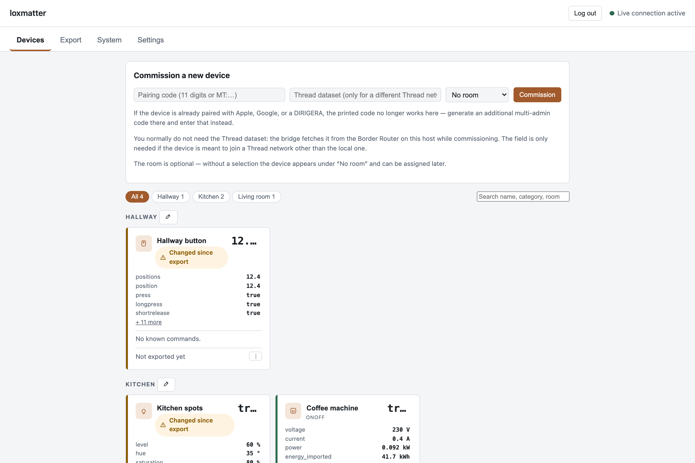
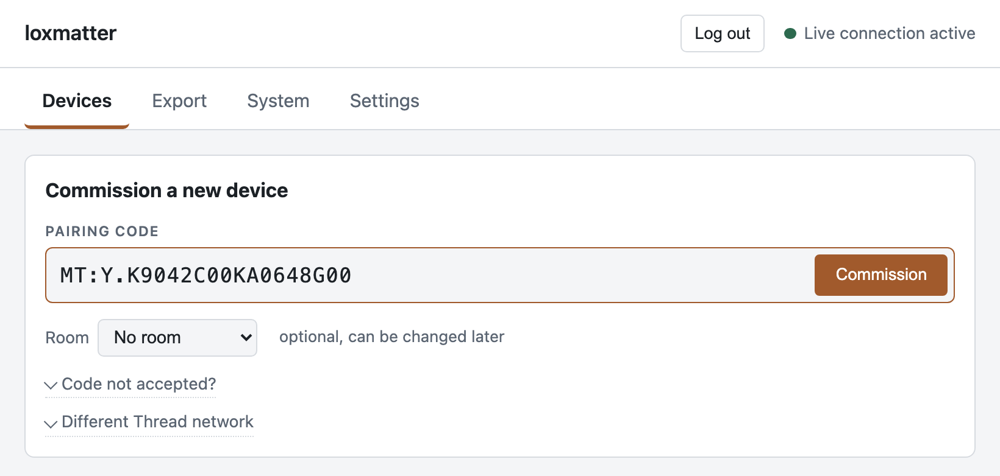
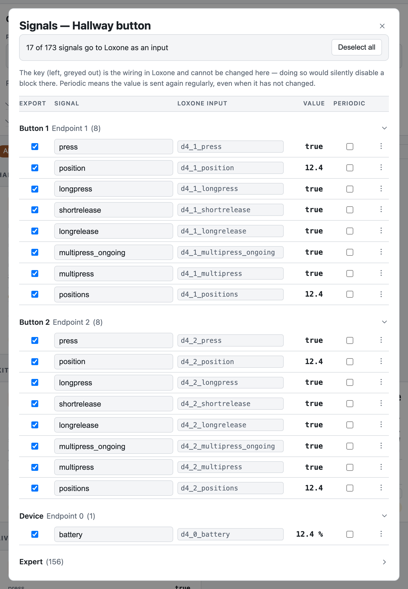
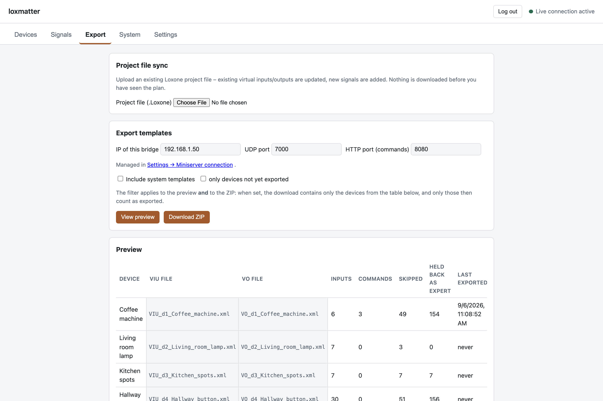
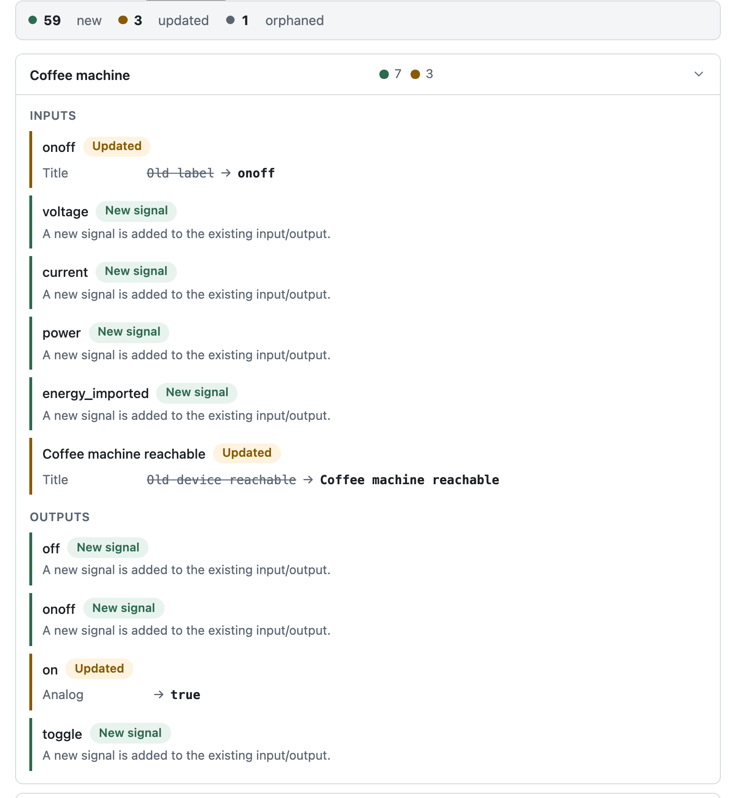
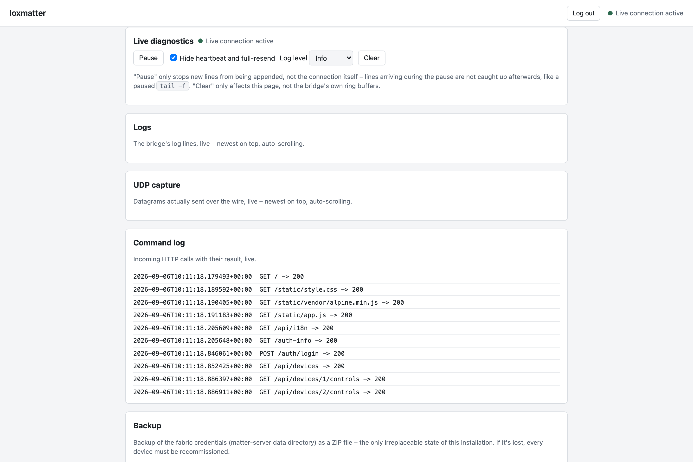
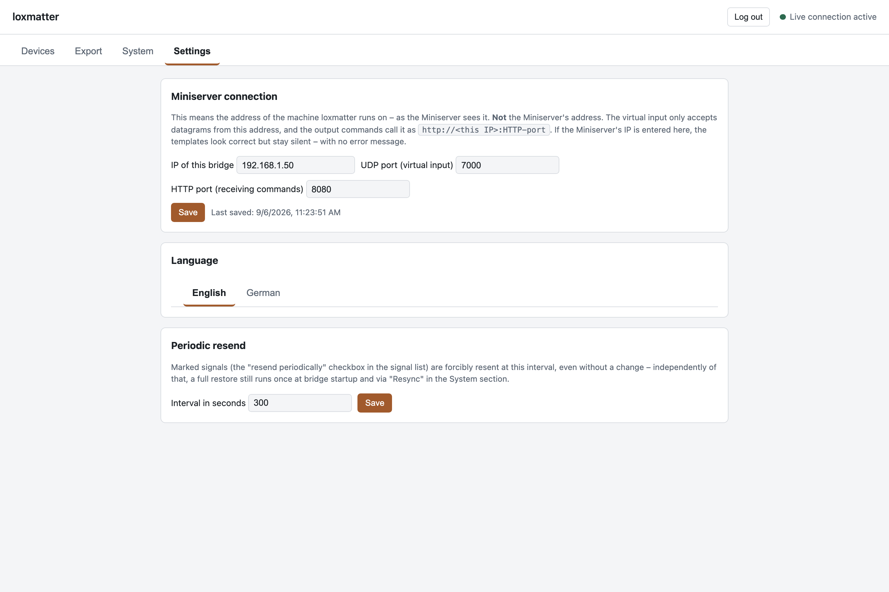
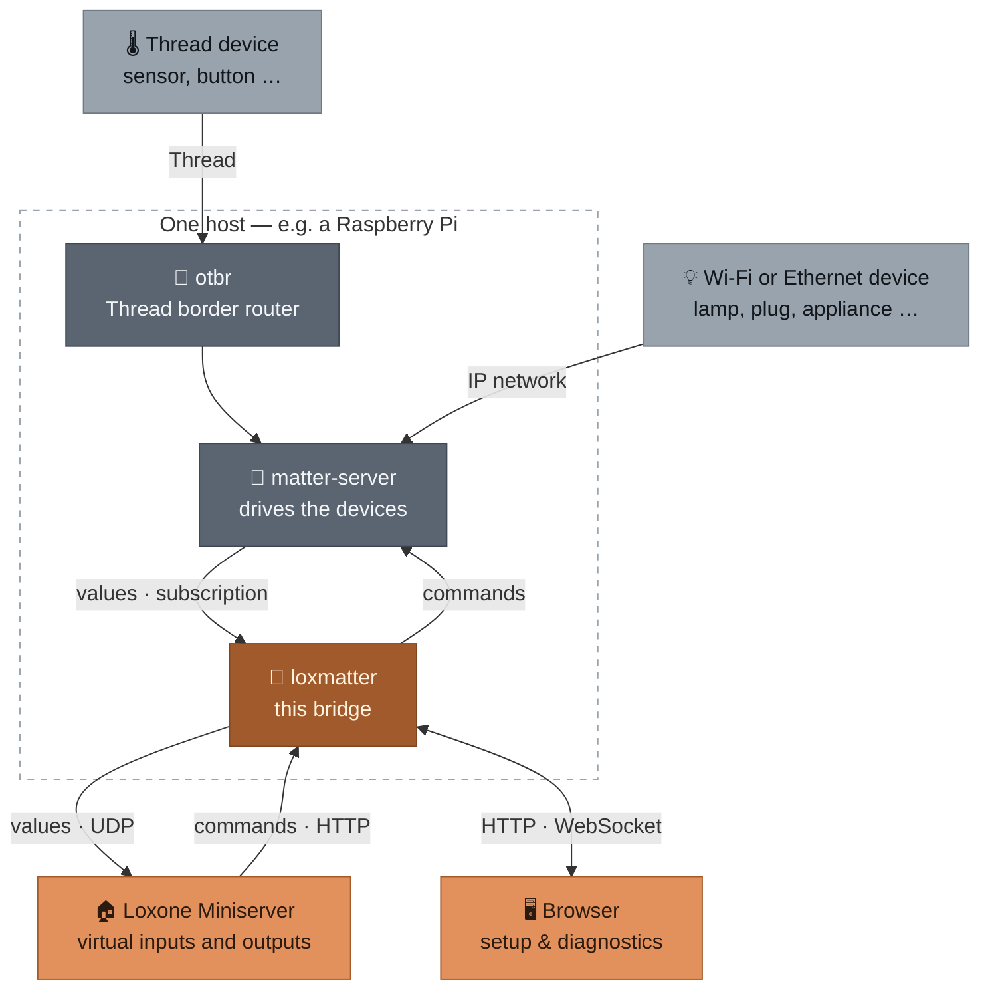

<div align="center">


# loxmatter

### Matter devices in Loxone — self-hosted, no cloud

Your Miniserver does not speak Matter. This bridge makes it anyway: every value a
Matter device reports becomes a virtual input, every Loxone command becomes a Matter
command, and the Loxone objects for it are generated rather than typed by hand.


[](https://github.com/lucienkerl/loxmatter/actions/workflows/ci.yml)

[What it does](#-what-you-can-do) · [Screenshots](#-the-web-interface) ·
[How it works](#-how-it-works) · [Quickstart](#-quickstart) · [Docs](#-documentation)

</div>

## Why loxmatter

Loxone has no Matter support, and Matter devices have no idea what a Miniserver is.
The usual answer is a cloud bridge per vendor. This is the other answer: one service
on your own hardware that reads devices generically — no curated list of supported
models, so a device bought tomorrow works today — and hands Loxone something it already
understands.

## ✨ What you can do

<table>
<tr>
<td width="50%" valign="top">

### 📟 Commission devices from the browser
Add a Matter device over Bluetooth with its setup code. Thread devices reach the
bridge through the border router in the same stack; Wi-Fi and Ethernet devices go
straight over IP.

</td>
<td width="50%" valign="top">

### 🎛 Pick the signals you actually want
A single plug can expose over a hundred values. The functional ones are selected by
default; everything else waits in a collapsed “expert” block with its own checkbox.

</td>
</tr>
<tr>
<td width="50%" valign="top">

### 📄 Generate the Loxone objects
Virtual UDP inputs and virtual outputs come out as importable template files, one
pair per device, instead of being typed into Loxone Config by hand.

</td>
<td width="50%" valign="top">

### 🔁 Patch your existing project file
Upload the Loxone project you already have, see exactly what would change per device
and per signal, download the patched copy. Nothing is downloaded before you have seen
the plan.

</td>
</tr>
<tr>
<td width="50%" valign="top">

### 🔍 Watch it work
A live feed of log lines, outgoing datagrams and incoming commands — the same lines
`docker logs` would show, without shell access to the host.

</td>
<td width="50%" valign="top">

### 🔒 Locked down by default, in your language
No `/api` route answers before a password is set. The interface speaks English or
German, switchable in the settings, and the setting applies to the CLI too.

</td>
</tr>
</table>

## 🖼 The web interface

<table>
<tr>
<td width="50%" valign="top">


**Devices**<br>Every commissioned device on one page, with live values and controls, and a badge where signals changed since the last export.

</td>
<td width="50%" valign="top">


**Commissioning**<br>Paste the pairing code from the device or its packaging and start — no vendor app, no account, no cloud round trip.

</td>
</tr>
<tr>
<td width="50%" valign="top">


**Signals**<br>Each signal with the Loxone address it will get and its own export checkbox; the administrative ones sit behind the collapsed expert section.

</td>
<td width="50%" valign="top">


**Export**<br>Upload a project file for a patched copy, or take the per-device template files — with the bridge address and ports they use shown alongside.

</td>
</tr>
<tr>
<td width="50%" valign="top">


**Project file sync**<br>The plan before anything is written: how many entries are new, updated or orphaned, and per device the old value next to the new one.

</td>
<td width="50%" valign="top">


**Diagnostics**<br>Log lines, the UDP capture and the command log, all running live; the Matter fabric backup is pulled from here too.

</td>
</tr>
<tr>
<td width="50%" valign="top">


**Settings**<br>The Miniserver connection, the interface language, and how often marked signals are resent even when nothing changed.

</td>
</tr>
</table>

## 🏗 How it works



`matter-server` holds the Matter fabric and delivers values by subscription. loxmatter
turns those values into datagrams for the Miniserver, and the commands coming back
from Loxone over HTTP into Matter commands. The browser hangs off the bridge for setup
and diagnostics only — the runtime path between devices and Miniserver does not use it.

## 🚀 Quickstart

Try it without any hardware:

```bash
git clone git@github.com:lucienkerl/loxmatter.git
cd loxmatter
uv sync
uv run loxmatter inspect --fixture tests/fixtures/nodes/example_light.json
```

For a real setup — Docker stack with `otbr`, `matter-server` and the bridge — follow
[docs/SETUP.md](docs/SETUP.md).

## 🗺 Status

Working and validated against two real IKEA devices on a running `matter-server`:
commissioning, signal extraction, the template export, the runtime path in both
directions, the web interface and its access control.

**Not yet done: the run against a real Miniserver.** The generated templates have only
been checked against a rebuilt Miniserver, never imported into Loxone Config.

**No TLS.** The service speaks plain HTTP — the password and any API token cross the
network in the clear. Use a randomly generated password that is used nowhere else.

**First come, first served.** Until a password is set, anyone who can reach the port
can claim the bridge. Set it within minutes of the first start, not days.

## 📚 Documentation

| Document | What is in it |
|---|---|
| [docs/SETUP.md](docs/SETUP.md) | [Requirements](docs/SETUP.md#requirements), the [hardware-free tour](docs/SETUP.md#try-it-without-hardware), [your own Docker setup](docs/SETUP.md#your-own-setup), and [looking at a device](docs/SETUP.md#looking-at-a-device) from the CLI. |
| [docs/OPERATIONS.md](docs/OPERATIONS.md) | [Running the bridge](docs/OPERATIONS.md#running-the-bridge), [what a template contains](docs/OPERATIONS.md#what-a-template-contains), [project file sync](docs/OPERATIONS.md#project-file-sync), [access control](docs/OPERATIONS.md#access-control) and [language](docs/OPERATIONS.md#language). |
| [docs/DEVELOPMENT.md](docs/DEVELOPMENT.md) | Running the test suite and the checks CI runs. |
| [docs/LICENSING.md](docs/LICENSING.md) | Third-party licences and the notices in the source files. |

## 🧰 Tech stack

Python 3.12+ with FastAPI and uvicorn for the HTTP service, Typer for the CLI,
[`python-matter-server`](https://github.com/home-assistant-libs/python-matter-server)
for the Matter side, SQLite for stored devices and settings. The web interface is plain
HTML, CSS and Alpine.js — no build step, nothing fetched from a CDN at runtime.

## Contributing

Issues and pull requests are welcome. Please run the checks from
[docs/DEVELOPMENT.md](docs/DEVELOPMENT.md) before opening one; the commit messages in
this repository are written in German.

## License

**GNU General Public License, version 3 or later** — the full text is in
[`LICENSE`](LICENSE). In practice: you may use, modify and pass on this tool, and
whoever passes on a modified version has to publish their changes under the same
licence. Third-party licences and the notices in each source file:
[docs/LICENSING.md](docs/LICENSING.md).
