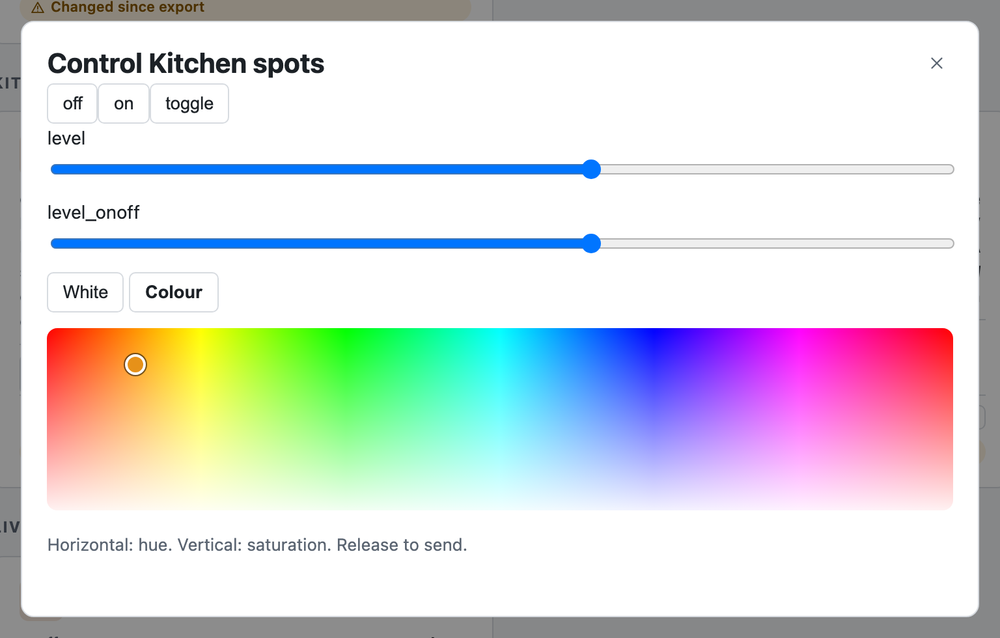
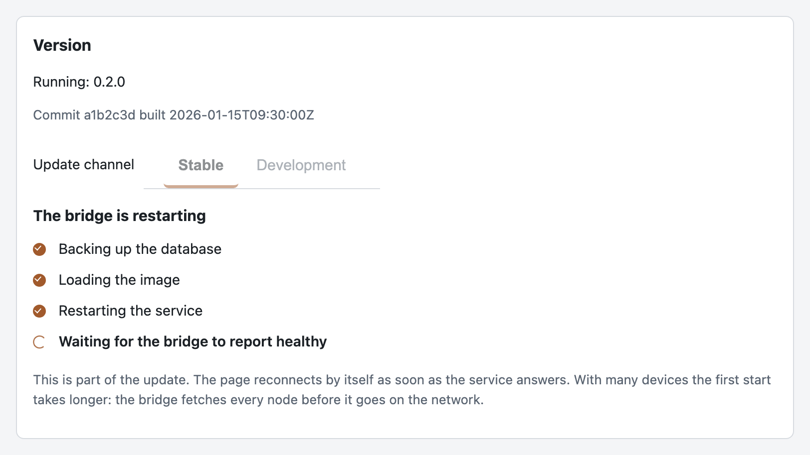
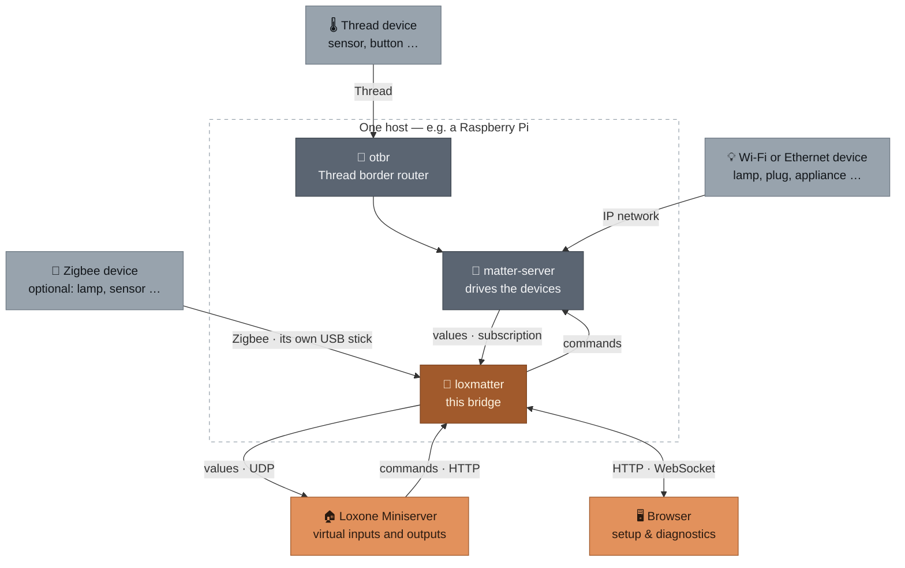

<div align="center">


# loxmatter

### Matter devices in Loxone — self-hosted, no cloud

Your Miniserver does not speak Matter. This bridge makes it anyway: any value a
Matter device reports can become a virtual input, every Loxone command becomes a
Matter command, and the Loxone objects for it are generated rather than typed by
hand.


[](https://github.com/lucienkerl/loxmatter/actions/workflows/ci.yml)

[What it does](#-what-you-can-do) · [Screenshots](#-the-web-interface) ·
[How it works](#-how-it-works) · [Quickstart](#-quickstart) · [Docs](#-documentation)

</div>

## Why loxmatter

Loxone has no Matter support, and Matter devices have no idea what a Miniserver is.
The usual answer is a cloud bridge per vendor. This is the other answer: one service
on your own hardware that reads devices generically — no curated list of supported
models, so a device bought tomorrow works today — and hands Loxone something it already
understands. That held without exception for attributes in testing; event detection is
FeatureMap-based and cluster-specific instead, since neither test device advertised an
`EventList`. Details, numbers and the consequences are in the design spec's validation
section,
[section 3.5](docs/superpowers/specs/2026-09-01-matter-loxone-bridge-design.md#35-mapping-generic-not-curated).

## ✨ What you can do

<table>
<tr>
<td width="50%" valign="top">

### 📟 Commission devices from the browser
Add a Matter device over Bluetooth with its setup code. Thread devices reach the
bridge through the border router in the same stack; Wi-Fi and Ethernet devices go
straight over IP. With a second USB stick as a Zigbee coordinator, Zigbee devices
pair from a tab of their own beside Matter's.

</td>
<td width="50%" valign="top">

### 🎛 Pick the signals you actually want
A single plug can expose over a hundred values. The functional ones are selected by
default; everything else waits in a collapsed “expert” block with its own checkbox.

</td>
</tr>
<tr>
<td width="50%" valign="top">

### 📄 Generate the Loxone objects
Virtual UDP inputs and virtual outputs come out as importable template files, one
pair per device, instead of being typed into Loxone Config by hand.

</td>
<td width="50%" valign="top">

### 🔁 Patch your existing project file
Upload the Loxone project you already have, see exactly what would change per device
and per signal, download the patched copy. Nothing is downloaded before you have seen
the plan. Existing inputs/outputs are updated, and devices the project does not know
yet get containers of their own, see
[docs/OPERATIONS.md#project-file-sync](docs/OPERATIONS.md#project-file-sync).

</td>
</tr>
<tr>
<td width="50%" valign="top">

### 🔍 Watch it work
A live feed of log lines, outgoing datagrams and incoming commands — the same lines
`docker logs` would show, without shell access to the host.

</td>
<td width="50%" valign="top">

### 🔒 Locked down by default, in your language
No `/api` route answers before a password is set. `/cmd` and `/resync` stay open
regardless — the Miniserver cannot send a header or a cookie — so whoever reaches the
port can still switch a device; see
[docs/OPERATIONS.md#access-control](docs/OPERATIONS.md#access-control). The interface
speaks English or German, switchable in the settings, and the setting applies to the
CLI too.

</td>
</tr>
</table>

## 🖼 The web interface

**Devices**<br>Every commissioned device on one page, with live values and controls, and a badge where signals changed since the last export.


**Commissioning**<br>Type the pairing code exactly as it's printed on the device or its packaging — the field writes the dashes in for you — and start; no account, no cloud round trip. A device already paired with Apple, Google or a DIRIGERA needs an extra multi-admin code from that vendor's app first; its own printed code no longer works here.


**Signals**<br>Open a device's signals from its tile menu: each signal with the Loxone address it will get and its own export checkbox; the administrative ones sit behind a collapsed expert section.


**Controls**<br>Drive a device by hand to find out whether it answers at all — a click here separates a broken device from broken Loxone wiring. Each command gets the control its value deserves: sliders for brightness, a color temperature slider bounded by what that particular lamp can actually do, a color area for hue and saturation. Nothing here is hard-coded per model: the White/Color tabs appear only on lamps that report both, so a white-spectrum bulb simply shows one slider and no tabs.



**Export**<br>Upload a project file for a patched copy, or generate the per-device template files — with the bridge address and ports they use shown alongside, and a preview of what each file will contain before anything downloads.


**Project file sync**<br>The plan before anything is written: how many entries are new, updated or orphaned, and per device the old value next to the new one.


**System**<br>Three live panes below the diagnostics controls — the command log fills as requests come in; log lines and UDP capture stream the same way once a real `matter-server` and device traffic sit behind the bridge. The Matter fabric backup is pulled from here too.


**Updating**<br>The same System tab shows what is running, tells you when a newer version is available, and installs it at the press of a button — a backup first, then the four steps shown here in order, with an automatic rollback if the new version never comes up healthy. See [Updating](#updating) below.



**Settings**<br>The Miniserver connection, the interface language, and how often marked signals are resent even when nothing changed.


## 🏗 How it works



`matter-server` holds the Matter fabric and delivers values by subscription. loxmatter
turns those values into datagrams for the Miniserver, and the commands coming back
from Loxone over HTTP into Matter commands. Zigbee is the exception to that path:
loxmatter drives a Zigbee stick itself, with zigpy running inside the bridge, and
translates its devices into the same shape as Matter's, so signals, export and
commands work the same for both. Matter stays required either way. The browser hangs
off the bridge for setup and diagnostics only — the runtime path between devices and
Miniserver does not use it.

## 🚀 Quickstart

One command on the machine that will run the bridge — a Raspberry Pi or any
Debian-based Linux host:

```bash
curl -fsSL https://raw.githubusercontent.com/lucienkerl/loxmatter/main/install.sh | sh
```

It asks for your Miniserver's IP address, detects the rest — network interface,
Thread radio, Bluetooth adapter — and starts the containers. When it finishes it
prints the address of the web interface. **Open it and set a password**: until you
do, no `/api` route answers.

**Prefer to read it before running it?** Same script, three lines:

```bash
curl -fsSLO https://raw.githubusercontent.com/lucienkerl/loxmatter/main/install.sh
less install.sh
sh install.sh
```

The script installs `git`, `curl`, `openssl` and Docker if they are missing, which
needs `sudo`. It says so before it does, but it does not ask. Add `--dry-run` — as
`… | sh -s -- --dry-run` — to see every step without changing anything. Running it
again is safe: it keeps your configuration, re-checks the stack, and offers to pull
in new commits.

**No Thread radio? That is fine.** With no USB radio the installer sets up
WiFi/Ethernet-only mode: the Thread border router is left out, and the bridge talks
to WiFi and Ethernet Matter devices over your existing network. Plug a radio in
later, set `COMPOSE_PROFILES=thread` and `RADIO_DEVICE` in
`deploy/testhost/.env`, and restart the stack.

**Changing sticks or adapters later stays out of the console too.**
Settings → Radios in the web UI lists the USB sticks and Bluetooth
adapters your host has, marks the ones in use, and applies a change you
pick — no `.env` edit needed. Switching only the Bluetooth adapter leaves
the Thread border router running the whole time; switching only the
Thread stick, or turning Thread off, leaves Bluetooth alone. If the new
setting does not come up healthy, the previous one comes back on its own.
The same card has a Zigbee row. A Zigbee stick is applied inside the bridge
itself, so choosing one restarts neither matter-server nor the Thread border
router, and the stick Thread is running on cannot be chosen for Zigbee. A
Zigbee stick that does not answer is not rolled back: the row shows why,
and the bridge keeps retrying until you pick another. The installer does
not detect Zigbee sticks; pick yours on the card.

Two Raspberry-Pi-specific steps — unblocking Bluetooth and restarting the Thread
agent — the installer reports but deliberately does not perform. Those, and the
full manual path, are in [docs/SETUP.md](docs/SETUP.md).

### Try it without any hardware

```bash
git clone git@github.com:lucienkerl/loxmatter.git
cd loxmatter
uv sync
uv run loxmatter inspect --fixture tests/fixtures/nodes/example_light.json
```

## Updating

```bash
cd ~/loxmatter && git pull && ./scripts/update.sh
```

The script backs up the signal database first, pulls the published image,
restarts only the bridge — matter-server and the Thread border router are
left alone — and waits until the bridge reports healthy again. This should
be quick on a Raspberry Pi, since pulling a finished image replaces the
five-to-ten-minute local build — but no timing has been measured yet.

`--build` builds from source instead of pulling, for development or for a
host that cannot reach `ghcr.io`.

The System tab shows which version is running.

Since 0.3.0 you can do this from the browser instead: **System → Version**
shows what is running, tells you when a newer version is available, and
installs it at the press of a button. A backup is taken first; if the new
version does not come up healthy, it rolls itself back and the previous
version keeps running. The bridge itself is unreachable for about a
minute while this happens — the page says so plainly and reconnects on
its own once the new version answers.

This needs the `loxmatter-updater` service from the compose file. An
installation that predates 0.3.0 does not have it yet; bring it in once
from the console, the same way as any other update:

```bash
cd ~/loxmatter && git pull && ./scripts/update.sh
```

That service is worth understanding before you rely on it: it holds the
Docker socket, and is therefore root-equivalent on the host — the same
level of trust `docker compose` itself already runs at. It has no ports
and no host network; it talks to the bridge only through files in a
shared volume. What it can do is install a published loxmatter version,
and change which existing USB stick the Thread border router uses (or
switch Thread off), and which existing Bluetooth adapter matter-server
uses — nothing else. It checks each of those against the host's devices
itself, touches no other setting and no other service, and never runs
text from a request as a command. If you would rather not have it on
your host, delete the service from the compose file — the bridge notices
it is gone and points you back to the console path above.

**What the bridge itself may open, for Zigbee.** The updater does not
apply a Zigbee stick — the bridge opens it directly — and so the bridge
is allowed to open USB serial devices without being told which one in
advance: the compose file gives it the device rules `c 188:* rmw`
(ttyUSB) and `c 166:* rmw` (ttyACM), plus a read-only view of the host's
`/dev` to list the sticks by name. Both are worth understanding. That
listing shows your hardware inventory, including the serial numbers in
the names under `/dev/serial/by-id`. And the rule reaches **every**
USB-serial adapter on the host, the Thread stick included: code running
inside the bridge could talk to any of them, and could garble the radio
your Thread border router depends on. The web UI and the API refuse to
use the Thread stick for Zigbee - and refuse every stick while the updater
service has not reported which one Thread uses - but that is a check in the
bridge's own code, not a boundary. The rule does **not** reach block devices,
`/dev/mem` or i2c; those stay refused even though the read-only `/dev`
shows them. You can narrow the rule to the device numbers you actually
see — `c 188:0 rmw` allows only what is `/dev/ttyUSB0` right now — at
the cost that the stick stops working after it is plugged into another
port and gets another number.

The Zigbee network key sits in clear text in zigpy's own database
(`zigbee.sqlite`, next to `loxmatter.sqlite` in the bridge's data volume),
where zigpy keeps it; loxmatter never writes it to its
log. There is deliberately no download for a Zigbee network backup yet,
because that backup carries the key, and the updater's pre-update backup
covers the bridge's own database (`loxmatter.sqlite`) only, not
`zigbee.sqlite`.

**It does not keep itself up to date.** It comes with the stack, the same
way `matter-server` and the Thread border router do, and it installs
updates *for the bridge* — it does not install them for itself. A
container cannot correctly replace itself with `docker compose up` run
from inside it: this was tried and measured to fail — the container that
must carry out the remaining steps of that command is one of the things
being stopped, and a Raspberry Pi run of exactly this left the host with
no running updater at all and a stray, half-created container next to it,
recoverable only from the console. When your updater sidecar falls behind
the bridge it serves, **System → Version** in the web UI says so and
gives you the one command to run:

```bash
cd ~/loxmatter/deploy/testhost && docker compose pull loxmatter-updater && docker compose up -d --no-deps loxmatter-updater
```

## 🗺 Status

**Built:** commissioning, signal extraction, the template export, the runtime path in
both directions, the web interface and its access control.

**Built, not yet run on hardware: Zigbee.** Pairing, the Zigbee row on the radios card,
configure-on-join and the runtime path are tested against simulated radios only; no
Zigbee stick has been driven by this code yet.

**Validated** against two real IKEA devices on a running `matter-server`:
commissioning, signal extraction, the runtime path in both directions, and the web
interface with its access control.

**Not yet done: the run against a real Miniserver.** The generated templates have only
been checked against a rebuilt Miniserver, never imported into Loxone Config.

**No TLS.** The service speaks plain HTTP — the password and any API token cross the
network in the clear. Use a randomly generated password that is used nowhere else.

**First come, first served.** Until a password is set, anyone who can reach the port
can claim the bridge. Set it within minutes of the first start, not days.

## 📚 Documentation

| Document | What is in it |
|---|---|
| [docs/SETUP.md](docs/SETUP.md) | [Requirements](docs/SETUP.md#requirements), the [hardware-free tour](docs/SETUP.md#try-it-without-hardware), [your own Docker setup](docs/SETUP.md#your-own-setup), and [looking at a device](docs/SETUP.md#looking-at-a-device) from the CLI. |
| [docs/OPERATIONS.md](docs/OPERATIONS.md) | [Running the bridge](docs/OPERATIONS.md#running-the-bridge), [what a template contains](docs/OPERATIONS.md#what-a-template-contains), [project file sync](docs/OPERATIONS.md#project-file-sync), [access control](docs/OPERATIONS.md#access-control) and [language](docs/OPERATIONS.md#language). |
| [docs/DEVELOPMENT.md](docs/DEVELOPMENT.md) | Running the test suite and the checks CI runs. |
| [docs/LICENSING.md](docs/LICENSING.md) | Third-party licences and the notices in the source files. |

## 🧰 Tech stack

Python 3.12+ with FastAPI and uvicorn for the HTTP service, Typer for the CLI,
[`matter-python-client`](https://github.com/matter-js/matterjs-server/tree/main/python_client)
for the Matter side, zigpy with its radio libraries and zha-quirks for the Zigbee side,
SQLite for stored devices and settings. The web interface is plain
HTML, CSS and Alpine.js — no build step, nothing fetched from a CDN at runtime.

## Contributing

Issues and pull requests are welcome. Please run the checks from
[docs/DEVELOPMENT.md](docs/DEVELOPMENT.md) before opening one. Everything here is
written in English — code, comments, documents and commit messages; the conventions
are in [CLAUDE.md](CLAUDE.md). Commit subjects before September 2026 are German and
stay that way: they are a record of what happened.

## License

**GNU General Public License, version 3 or later** — the full text is in
[`LICENSE`](LICENSE). In practice: you may use, modify and pass on this tool, and
whoever passes on a modified version has to publish their changes under the same
licence. Third-party licences and the notices in each source file:
[docs/LICENSING.md](docs/LICENSING.md).
