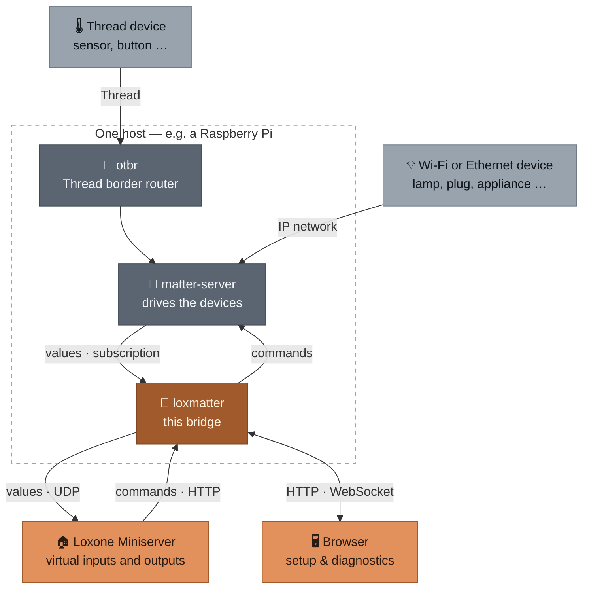

# README as a product page — implementation plan

> **For agentic workers:** REQUIRED SUB-SKILL: Use superpowers:subagent-driven-development (recommended) or superpowers:executing-plans to implement this plan task-by-task. Steps use checkbox (`- [ ]`) syntax for tracking.

**Goal:** Turn today's 404-line German manual README into an English product page with screenshots, and move the operational details into `docs/`.

**Architecture:** Seven tasks in three waves. Wave A (tasks 1–2) builds the screenshot infrastructure: a seeded demo-instance script and a Playwright script that produces seven PNGs from it. Wave B (tasks 3–5) moves and translates the four detail documents — independent of wave A. Wave C (tasks 6–7) rewrites the README and, at the end, checks links, warnings, and completeness.

**Tech Stack:** Python 3.12, `uv`, FastAPI/uvicorn (already in the project), Playwright (only as an ad-hoc dependency via `uv run --with`, **not** in `pyproject.toml`), Mermaid (rendered by GitHub), Markdown.

**Design:** [`docs/superpowers/specs/2026-09-05-readme-product-page-design.md`](../specs/2026-09-05-readme-product-page-design.md)

## Global Constraints

- **User-facing documentation is English.** `README.md` and everything under `docs/*.md` (not `docs/superpowers/`). Code comments, commit messages, and `docs/superpowers/**` stay German.
- **Spelling `Wi-Fi`**, not `WiFi`. Transports are always named as **Thread, Wi-Fi, or Ethernet** — never just "Thread and WiFi". Reasoning: the design spec already talks about Wi-Fi/Ethernet under "mDNS reachable".
- **These eight warnings must be preserved** (design section 6). Task 7 checks each one individually:
  1. The integration test against a real Miniserver is missing — templates never imported into Loxone Config.
  2. No TLS; password and token travel in plaintext over the network.
  3. Trust on first use — time window between start and the first password being set.
  4. `/cmd` is a GET without origin checking, triggerable via `` from any web page.
  5. Project-file sync: new device containers experimental, ID scheme unverified.
  6. `deploy/testhost/` is not a hardened production image.
  7. The schema migration resets export checkboxes that were set.
  8. A language switch only affects **newly** generated templates.
  Points 1, 2, and 3 must appear visibly in the README itself, not only linked.
- **Cross-references point to the new home, not to the old README.** The old README points, in many places, to its own sections ("set a password, see Access control below"). When moved, that becomes a link to the file the section moves into — not to a README anchor that no longer exists after task 6. The target anchors are given in each task's **Interfaces**: `SETUP.md#requirements`/`#try-it-without-hardware`/`#your-own-setup`/`#looking-at-a-device`, `OPERATIONS.md#running-the-bridge`/`#what-a-template-contains`/`#project-file-sync`/`#access-control`/`#language`. Within `docs/`, these are sibling paths without `../`. Noticed while running task 3, after two links pointed to `README.md#dauerhaft-betreiben-loxmatter-run`.
- **No change to application code, behavior, or existing tests.** New files only under `scripts/`, `docs/`, and `docs/screenshots/`.
- **Screenshots contain no real data** — only fixture devices, bridge IP `192.168.1.50`, Miniserver `192.168.1.10`.
- **Source text of the old README:** up through task 6 it lives in `README.md`. After that: `git show 8002484:README.md`.

---

### Task 1: `--demo` mode for the existing dev server

**Files:**
- Modify: `scripts/dev_web_server.py`

**Interfaces:**
- Produces: the `--demo` switch and the unchanged default without it. Task 2 starts `uv run python scripts/dev_web_server.py --demo --port 8420` and expects the service on `http://127.0.0.1:8420/`, already with the password `loxmatter-demo` set and the bridge IP stored.

**Why not a new script:** `scripts/dev_web_server.py` already does the hard part — loading fixtures, registering devices, calling `build_app` without a Matter client, serving. Above all it contains `_SeededRuntime`: about 40 lines of documented duck typing that satisfies `_RuntimeDependency` and is what gives the device cards values at all. A second script would have to copy that, and the copy would drift.

**What's missing** for automated screenshots: a pre-set password (otherwise the initial setup shows in the picture), stored bridge settings (otherwise the Export tab blocks with "set the bridge IP first"), English device names, and more than two devices.

- [ ] **Step 1: Read the file**

```bash
cat scripts/dev_web_server.py
```

What matters is `_load_snapshot`, `_ensure_devices`, `_seed_values`, `_SeededRuntime`, and `_parse_args`. The code below builds on that and replaces none of it.

- [ ] **Step 2: Add the import and demo data**

To the existing imports:

```python
from loxmatter.auth.passwords import hash_password
```

After the `FIXTURES` line:

```python
DEMO_PASSWORD = "loxmatter-demo"

# Order determines the order in the device list - the plug first, because
# its signal list best shows the functional/expert distinction (over a
# hundred signals, a handful of them functional).
DEMO_DEVICES = [
    ("ikea_grillplats_plug.json", "Coffee machine"),
    ("example_light.json", "Living room lamp"),
    ("synthetic_color_light.json", "Kitchen spots"),
    ("ikea_bilresa_button.json", "Hallway button"),
]


def _ensure_demo_devices(store: Store) -> list[int]:
    """Like `_ensure_devices`, but four devices with English names: the
    README screenshots show an English UI, German device names in it
    would look like an oversight."""
    if store.devices():
        return [device.id for device in store.devices()]

    device_ids: list[int] = []
    for filename, label in DEMO_DEVICES:
        snapshot = _load_snapshot(filename)
        device_id = store.register_device(snapshot)
        store.register_signals(device_id, snapshot)
        store.register_commands(device_id, extract_commands(snapshot), snapshot.node_id)
        store.rename_device(device_id, label)
        device_ids.append(device_id)

    # One device counts as already exported, so the export preview shows
    # both cases side by side instead of four identical-looking rows.
    store.mark_exported(device_ids[0])
    return device_ids
```

- [ ] **Step 3: Hook in the switch**

In `_parse_args`, change the default value of `--store-path` to `None` and add `--demo`:

```python
    parser.add_argument(
        "--store-path",
        type=Path,
        default=None,
        help="Datenbankdatei (Default: eine feste Datei im Temp-Verzeichnis).",
    )
    parser.add_argument("--port", type=int, default=8420)
    parser.add_argument(
        "--demo",
        action="store_true",
        help=(
            "Vier Geraete mit englischen Namen, Passwort und Bridge-Einstellungen "
            "vorbelegt, Datenbank bei jedem Start frisch - fuer die README-Screenshots."
        ),
    )
```

`main()` becomes:

```python
def main() -> None:
    args = _parse_args()

    # Dedicated database file for demo mode, and it is recreated fresh on
    # every start: only that way does the same call produce the same
    # screenshots twice. Normal development mode keeps its data.
    default_name = "loxmatter-demo-web.sqlite" if args.demo else "loxmatter-dev-web.sqlite"
    store_path = args.store_path or Path(tempfile.gettempdir()) / default_name
    if args.demo and args.store_path is None:
        store_path.unlink(missing_ok=True)

    store = Store(store_path)
    if args.demo:
        store.auth.reset_password(hash_password(DEMO_PASSWORD))
        store.settings.save(bridge_ip="192.168.1.50", udp_port=7000, listen_port=8080)
        device_ids = _ensure_demo_devices(store)
    else:
        device_ids = _ensure_devices(store)

    values = _seed_values(store, device_ids)
    runtime = _SeededRuntime(values)
    app = build_app(store, _invoke, runtime)
    print(f"Datenbank: {store_path}")
    print(f"WebUI: http://127.0.0.1:{args.port}")
    uvicorn.run(app, host="127.0.0.1", port=args.port)
```

- [ ] **Step 4: Check both modes**

```bash
uv run python scripts/dev_web_server.py --demo --port 8420 &
sleep 4
curl -s -o /dev/null -w "start=%{http_code}\n" http://127.0.0.1:8420/
curl -s http://127.0.0.1:8420/auth-info
kill %1
```

Expected: `start=200`, and `/auth-info` answers with `{"password_set":true,"authenticated":false}` — i.e. not the initial setup. The path has **no** `/api` prefix: the access routes deliberately sit outside the guard, otherwise you could get nowhere before the first login (see `src/loxmatter/api/auth.py`, module docstring).

Then the unchanged default:

```bash
uv run python scripts/dev_web_server.py --port 8421 &
sleep 4
curl -s -o /dev/null -w "start=%{http_code}\n" http://127.0.0.1:8421/
kill %1
```

Expected: `start=200` and still the initial setup — without `--demo`, nothing should have changed.

- [ ] **Step 5: Commit**

```bash
git add scripts/dev_web_server.py
git commit -m "docs(screenshots): --demo-Betriebsart fuer den Dev-Server"
```

---

### Task 2: Generate the seven screenshots

**Files:**
- Create: `scripts/capture_screenshots.py`
- Create: `docs/screenshots/dashboard.png`, `commissioning.png`, `signals.png`, `export.png`, `project-sync.png`, `system.png`, `settings.png`

**Interfaces:**
- Consumes: `scripts/dev_web_server.py --demo` from task 1 (as a subprocess on port 8420, password `loxmatter-demo`, bridge IP already set).
- Produces: seven PNGs under `docs/screenshots/`, which task 6 references with ``.

- [ ] **Step 1: Get selectors from the markup, don't invent them**

The UI has changed three times in a week. Before writing anything, look up the real hooks:

```bash
grep -n "password\|login\|setup" src/loxmatter/web/index.html | head -20
grep -n "selectView(" src/loxmatter/web/index.html | head -10
grep -n 'x-show="view ===' src/loxmatter/web/index.html
grep -n "projectSync\|uploadProjectFile" src/loxmatter/web/index.html | head -5
```

The views are called `devices`, `signals`, `export`, `system`, `settings` and are switched via `selectView('<name>')`. The login is a password field plus a button; the exact attributes are in the markup.

- [ ] **Step 2: Provision Playwright**

```bash
uv run --with playwright python -m playwright install chromium
```

Expected: the download ends with "Chromium … downloaded to …". Playwright does **not** go into `pyproject.toml` — it's only needed to regenerate the images.

- [ ] **Step 3: Write the capture script**

Insert the selectors from step 1 wherever `# from step 1` appears below.

```python
"""Photographs the UI for the README.

Usage:  uv run --with playwright python scripts/capture_screenshots.py

Starts `dev_web_server.py --demo` itself, logs in, walks through the
views, and drops the images under docs/screenshots/. Called twice, it
produces the same images - the demo database is recreated fresh on every
start (see there).
"""

from __future__ import annotations

import subprocess
import sys
import time
from pathlib import Path

from playwright.sync_api import Page, sync_playwright

ROOT = Path(__file__).resolve().parents[1]
SHOTS = ROOT / "docs" / "screenshots"
PORT = 8420
BASE = f"http://127.0.0.1:{PORT}"
PASSWORD = "loxmatter-demo"


def shoot(page: Page, name: str) -> None:
    page.wait_for_timeout(600)  # Alpine re-renders after loading
    SHOTS.mkdir(parents=True, exist_ok=True)
    page.screenshot(path=str(SHOTS / f"{name}.png"))
    print(f"  {name}.png")


def capture(page: Page) -> None:
    page.goto(BASE, wait_until="networkidle")
    page.fill('input[type="password"]', PASSWORD)  # from step 1
    page.click('button:has-text("Sign in")')  # from step 1
    page.wait_for_timeout(1200)

    shoot(page, "dashboard")

    page.evaluate("document.querySelector('[x-data]')._x_dataStack[0].selectView('signals')")
    shoot(page, "signals")

    page.evaluate("document.querySelector('[x-data]')._x_dataStack[0].selectView('export')")
    shoot(page, "export")

    page.evaluate("document.querySelector('[x-data]')._x_dataStack[0].selectView('system')")
    shoot(page, "system")

    page.evaluate("document.querySelector('[x-data]')._x_dataStack[0].selectView('settings')")
    shoot(page, "settings")


def main() -> int:
    server = subprocess.Popen(
        [
            sys.executable,
            str(ROOT / "scripts" / "dev_web_server.py"),
            "--demo",
            "--port",
            str(PORT),
        ]
    )
    try:
        time.sleep(4)
        with sync_playwright() as pw:
            browser = pw.chromium.launch()
            page = browser.new_page(viewport={"width": 1440, "height": 960}, device_scale_factor=2)
            capture(page)
            browser.close()
    finally:
        server.terminate()
        server.wait(timeout=10)
    return 0


if __name__ == "__main__":
    raise SystemExit(main())
```

The `page.evaluate` detour through Alpine's data stack is deliberate: a click on the tab would be nicer, but depends on the navigation's exact markup. If the click works via `page.click('nav.tabs button:has-text("Signals")')`, that is the better version — use it then.

- [ ] **Step 4: Add the two special cases**

`commissioning.png` and `project-sync.png` need more than just switching a tab.

For `commissioning.png`: the commissioning card sits at the top of the Devices tab. Enter an example code, **without** submitting (without a Matter connection it would just error), then photograph:

```python
page.evaluate("document.querySelector('[x-data]')._x_dataStack[0].selectView('devices')")
page.fill('input[placeholder*="MT:"]', "MT:Y.K9042C00KA0648G00")  # selector from step 1
shoot(page, "commissioning")
```

For `project-sync.png`: upload the example project file from the tests and wait for the diff plan:

```python
from tests.projectsync.conftest import SAMPLE_PROJECT  # import at the top

sample = ROOT / "docs" / "screenshots" / "_sample.Loxone"
sample.write_text(SAMPLE_PROJECT, encoding="utf-8")
page.evaluate("document.querySelector('[x-data]')._x_dataStack[0].selectView('export')")
page.set_input_files('input[type="file"]', str(sample))
page.wait_for_timeout(2500)  # upload plus diff computation
shoot(page, "project-sync")
sample.unlink()
```

For `from tests…` to be importable, `ROOT` has to be on `sys.path`:

```python
sys.path.insert(0, str(ROOT))
```

- [ ] **Step 5: Run it and look at the images**

```bash
uv run --with playwright python scripts/capture_screenshots.py
ls -la docs/screenshots/
```

Expected: seven PNGs, each clearly over 40 KB. A file under 20 KB is almost always an empty or not-yet-rendered view.

**Then actually look at every image** (Read tool on the PNG file). Check: no empty states, no login screen where content should be, no visible error messages, `_sample.Loxone` deleted again. An image showing an error message is a failure of the task, not a cosmetic flaw.

- [ ] **Step 6: Commit**

```bash
git add scripts/capture_screenshots.py docs/screenshots/
git commit -m "docs(screenshots): sieben Aufnahmen der Oberflaeche samt Aufnahmeskript"
```

---

### Task 3: `docs/SETUP.md`

**Files:**
- Create: `docs/SETUP.md`
- Read: `README.md` lines 84–171 and 182–193

**Interfaces:**
- Produces: `docs/SETUP.md` with the anchors `#requirements`, `#try-it-without-hardware`, `#your-own-setup`, `#looking-at-a-device`. Task 6 links to it.

- [ ] **Step 1: Translate and assemble**

Source is three sections of the old README, in this order: "Prerequisites" ("Voraussetzungen", 84–109), "Getting started" ("Erste Schritte") with both subsections (111–171), "Looking at a device" ("Ein Gerät ansehen", 182–193).

Translate section by section, don't freely retell. Must be preserved:

- The complete hardware list including the Thread radio module and Bluetooth adapter.
- The sentence that no prior knowledge of Matter or Thread is needed.
- **Warning 6:** the blockquote that `deploy/testhost/` is not a hardened production image (non-root, pinned digests open).
- All code blocks unchanged — commands are not translated.
- All links to `deploy/testhost/`, adjusted for the new depth: `deploy/testhost/` becomes `../deploy/testhost/`.

Header:

```markdown
# Setup

[Back to the README](../README.md)
```

Name transports throughout as "Thread, Wi-Fi or Ethernet" (Global Constraints).

**No diagram in this file.** The complete architecture diagram lives in the README (task 6) — the same drawing a second time here would be redundancy that drifts apart at the next rework. Instead, at the point where the Docker containers are explained, a reference:

```markdown
See [how the pieces fit together](../README.md#-how-it-works) for what each of the three
containers does.
```

- [ ] **Step 2: Check links**

```bash
grep -oE '\]\([^)#][^)]*\)' docs/SETUP.md | tr -d ']()' | while read -r p; do
  [ -e "docs/$p" ] || [ -e "$p" ] || echo "TOT: $p"
done
```

Expected: no output.

- [ ] **Step 3: Commit**

```bash
git add docs/SETUP.md
git commit -m "docs(setup): Voraussetzungen und Erste Schritte nach docs/SETUP.md, englisch"
```

---

### Task 4: `docs/OPERATIONS.md`

**Files:**
- Create: `docs/OPERATIONS.md`
- Read: `README.md` lines 195–360

**Interfaces:**
- Produces: `docs/OPERATIONS.md` with the anchors `#running-the-bridge`, `#what-a-template-contains`, `#project-file-sync`, `#access-control`, `#language`. Task 6 links to it.

This is the largest translation block: 165 lines of dense prose, half of it the "Access control" section with security-relevant statements. Do not summarize any of it.

- [ ] **Step 1: Translate**

Source in this order: "Running it permanently: `loxmatter run`" ("Dauerhaft betreiben", 195–258), "Access control" ("Zugangsschutz", 260–337), "Language: English or German" ("Sprache: Englisch oder Deutsch", 339–360).

These statements must be preserved verbatim in substance — they are the reason this document exists:

- **Warning 2 (no TLS):** password and token go in plaintext; use a **randomly generated** password used nowhere else.
- **Warning 3 (trust on first use):** whoever gets there first sets the password; the time window should last minutes, not days.
- **Warning 4 (`/cmd`):** GET without origin checking, triggerable via `` from any web page someone opens from the network — a foothold in the LAN is not required for this.
- **Warning 5 (project-file sync):** new device containers are experimental, the ID scheme comes from a single real project file, is not officially documented, and **not verified**; before trusting it for the first time, open a patched file in Loxone Config and check it.
- **Warning 7 (schema migration):** resets the export checkbox of **every** stored signal to its default value, without warning.
- **Warning 8 (language switch):** only affects **newly** generated templates.
- The `set-password` trap on a containerized installation (database in a volume, `set-password` on the host would hit a different, empty database — so the command aborts).
- The token requirements: no spaces, no comma, no non-ASCII; `openssl rand -hex 32`; a token of pure whitespace counts as not set.
- That `/cmd` and `/resync` deliberately stay open always, because the Miniserver cannot send a header.

Header:

```markdown
# Running loxmatter

[Back to the README](../README.md)
```

Links to `docs/superpowers/specs/…` become `superpowers/specs/…`, links to `deploy/testhost/…` become `../deploy/testhost/…`.

- [ ] **Step 2: Cross-check the warnings**

After writing, search for each of the six points named above in the finished document and check them off. If one is missing, the task is not done.

- [ ] **Step 3: Check links**

```bash
grep -oE '\]\([^)#][^)]*\)' docs/OPERATIONS.md | tr -d ']()' | while read -r p; do
  [ -e "docs/$p" ] || [ -e "$p" ] || echo "TOT: $p"
done
```

Expected: no output.

- [ ] **Step 4: Commit**

```bash
git add docs/OPERATIONS.md
git commit -m "docs(operations): Betrieb, Zugangsschutz und Sprache nach docs/OPERATIONS.md, englisch"
```

---

### Task 5: `docs/DEVELOPMENT.md` and `docs/LICENSING.md`

**Files:**
- Create: `docs/DEVELOPMENT.md`
- Create: `docs/LICENSING.md`
- Read: `README.md` lines 173–180 and 376–404

Both are short and are done together — they share a commit, because neither is worth a review pass on its own.

- [ ] **Step 1: Write `docs/DEVELOPMENT.md`**

Source: "Developing" ("Entwickeln", 173–180). The section is eight lines long; it may be extended with things that demonstrably hold in the repository and that a contributor needs right away:

```markdown
# Development

[Back to the README](../README.md)

```bash
uv sync
uv run pytest
```

The test suite runs without hardware and without network access.

## Checks that CI runs

```bash
uv run ruff check src tests
uv run ruff format --check src tests
uv run mypy src
```
```

Before adopting these, check that these three commands really are what CI runs:

```bash
cat .github/workflows/ci.yml
```

If CI differs, CI wins.

- [ ] **Step 2: Write `docs/LICENSING.md`**

Source: "Third-party software" ("Fremdsoftware", 376–393) and "Notices in the source files" ("Hinweise in den Quelldateien", 395–404). The table of dependencies with their licenses stays complete, as do both justifications: that Apache-2.0 is one-directionally compatible with GPL-3.0, and that the GPL notice in the source files is deliberately in the FSF's English wording.

Header as above, heading `# Licensing`.

- [ ] **Step 3: Commit**

```bash
git add docs/DEVELOPMENT.md docs/LICENSING.md
git commit -m "docs: Entwickeln und Lizenzdetails nach docs/, englisch"
```

---

### Task 6: The new README

**Files:**
- Modify: `README.md` — fully replaced
- Read: `docs/screenshots/` (from task 2), `docs/SETUP.md`, `docs/OPERATIONS.md`, `docs/DEVELOPMENT.md`, `docs/LICENSING.md`

**Interfaces:**
- Consumes: the seven PNGs from task 2 and the four documents from tasks 3–5.

- [ ] **Step 1: Hero, badges, anchor links**

```markdown
<div align="center">


# loxmatter

### Matter devices in Loxone — self-hosted, no cloud

Your Miniserver does not speak Matter. This bridge makes it anyway: every value a
Matter device reports becomes a virtual input, every Loxone command becomes a Matter
command, and the Loxone objects for it are generated rather than typed by hand.


[](https://github.com/lucienkerl/loxmatter/actions/workflows/ci.yml)

[What it does](#-what-you-can-do) · [Screenshots](#-the-web-interface) ·
[How it works](#-how-it-works) · [Quickstart](#-quickstart) · [Docs](#-documentation)

</div>
```

Before adopting this, check the CI badge — the file and job name have to match `.github/workflows/ci.yml`.

- [ ] **Step 2: "Why loxmatter" and the feature table**

```markdown
## Why loxmatter

Loxone has no Matter support, and Matter devices have no idea what a Miniserver is.
The usual answer is a cloud bridge per vendor. This is the other answer: one service
on your own hardware that reads devices generically — no curated list of supported
models, so a device bought tomorrow works today — and hands Loxone something it already
understands.

## ✨ What you can do

<table>
<tr>
<td width="50%" valign="top">

### 📟 Commission devices from the browser
Add a Matter device over Bluetooth with its setup code. Thread devices reach the
bridge through the border router in the same stack; Wi-Fi and Ethernet devices go
straight over IP.

</td>
<td width="50%" valign="top">

### 🎛 Pick the signals you actually want
A single plug can expose over a hundred values. The functional ones are selected by
default; everything else waits in a collapsed “expert” block with its own checkbox.

</td>
</tr>
<tr>
<td width="50%" valign="top">

### 📄 Generate the Loxone objects
Virtual UDP inputs and virtual outputs come out as importable template files, one
pair per device, instead of being typed into Loxone Config by hand.

</td>
<td width="50%" valign="top">

### 🔁 Patch your existing project file
Upload the Loxone project you already have, see exactly what would change per device
and per signal, download the patched copy. Nothing is downloaded before you have seen
the plan.

</td>
</tr>
<tr>
<td width="50%" valign="top">

### 🔍 Watch it work
A live feed of log lines, outgoing datagrams and incoming commands — the same lines
`docker logs` would show, without shell access to the host.

</td>
<td width="50%" valign="top">

### 🔒 Locked down by default, in your language
No `/api` route answers before a password is set. The interface speaks English or
German, switchable in the settings, and the setting applies to the CLI too.

</td>
</tr>
</table>
```

- [ ] **Step 3: Screenshots and architecture**

Gallery of the seven images, two per row, in the same `<table>` pattern as above, each with `.png" alt="…">`, a bold caption, and one explanatory line. Order: dashboard · commissioning, signals · export, project-sync · system, settings alone in the last row.

Then the architecture section. This Mermaid block is the agreed version (variant 1) and is adopted **verbatim** — no `%%{init}%%` theme, or GitHub's dark mode breaks:

````markdown
## 🏗 How it works


````

Below that, a paragraph on the data flow: `matter-server` holds the fabric and delivers values via subscription; loxmatter translates them into datagrams to the Miniserver and translates Loxone commands back into Matter commands; the browser is only attached for setup and diagnostics.

- [ ] **Step 4: Quickstart, status, documentation, closing**

Quickstart — three steps, compact, with a note that the full path lives in `docs/SETUP.md`:

````markdown
## 🚀 Quickstart

Try it without any hardware:

```bash
git clone git@github.com:lucienkerl/loxmatter.git
cd loxmatter
uv sync
uv run loxmatter inspect --fixture tests/fixtures/nodes/example_light.json
```

For a real setup — Docker stack with `otbr`, `matter-server` and the bridge — follow
[docs/SETUP.md](docs/SETUP.md).
````

Then the status section. It carries warnings 1, 2, and 3 visibly, not only linked:

```markdown
## 🗺 Status

Working and validated against two real IKEA devices on a running `matter-server`:
commissioning, signal extraction, the template export, the runtime path in both
directions, the web interface and its access control.

**Not yet done: the run against a real Miniserver.** The generated templates have only
been checked against a rebuilt Miniserver, never imported into Loxone Config.

**No TLS.** The service speaks plain HTTP — the password and any API token cross the
network in the clear. Use a randomly generated password that is used nowhere else.

**First come, first served.** Until a password is set, anyone who can reach the port
can claim the bridge. Set it within minutes of the first start, not days.
```

Documentation table with four rows (`docs/SETUP.md`, `docs/OPERATIONS.md`, `docs/DEVELOPMENT.md`, `docs/LICENSING.md`), one line of description each. After that a short tech-stack block, a two-line contributing paragraph, and the license section: GPL-3.0-or-later, one sentence on what that means in practice, link to `LICENSE` and to `docs/LICENSING.md`.

- [ ] **Step 5: Look at it before committing**

```bash
wc -l README.md
grep -c '!\[\| /tmp/readme-alt.md
grep -n '^#' /tmp/readme-alt.md
```

For every heading of the old README, name where its content lives now. Expected mapping: "What loxmatter does" ("Was macht loxmatter") → README "Why" plus diagram; "Status" ("Stand") → README "Status"; "Prerequisites", "Getting started", "Looking at a device" ("Voraussetzungen", "Erste Schritte", "Ein Gerät ansehen") → `SETUP.md`; "Developing" ("Entwickeln") → `DEVELOPMENT.md`; "Running it permanently", "Access control", "Language" ("Dauerhaft betreiben", "Zugangsschutz", "Sprache") → `OPERATIONS.md`; "License" ("Lizenz") → README plus `LICENSING.md`; "Third-party software", "Notices in the source files" ("Fremdsoftware", "Hinweise in den Quelldateien") → `LICENSING.md`. Anything without a new home is a finding.

- [ ] **Step 4: Test suite as a regression guard**

```bash
uv run pytest -q
```

Expected: unchanged, green. This work touches no application code — if something fails, it isn't from this, but it gets reported anyway.

- [ ] **Step 5: Commit, if steps 1–3 found something**

```bash
git add -A
git commit -m "docs: Funde aus der Abnahme nachgezogen"
```

---

## Plan self-check

**Coverage against the design:** section 3 (README structure) → task 6. Section 4 (docs/ split) → tasks 3–5. Section 5 (screenshots) → tasks 1–2. Section 6 (warnings) → Global Constraints plus task 7, step 2. Section 7 (out of scope) → Global Constraints. Section 8 (risks) → task 7, steps 1–3.

**Deliberately left open:** the quickstart describes manual installation. The one-liner script is built in its own session and updates task 6, step 4 afterward.

**Known weak spot:** the selectors in task 2 (login field, commissioning code field, file input) are derived from today's markup and therefore carry the explicit caveat from step 1 — grep first, then write. This is the point where this work is most likely to break.

**Corrected while writing the plan:**

- Task 1 was originally called "new script `scripts/demo_instance.py`". While checking the signatures, `scripts/dev_web_server.py` turned up, which already does the same thing — including `_SeededRuntime`, without which the device cards in the screenshots would show only dashes. The new script became a `--demo` mode of the existing one.
- The first draft imported `MatterCall` from `loxmatter.matter.models`; it lives in `loxmatter.commands.translate`. Resolved by switching to `dev_web_server.py`, which already has the import right.
- `docs/SETUP.md` was supposed to repeat the architecture diagram. With variant 1 in the README, that would be the same drawing twice — now a reference instead.
