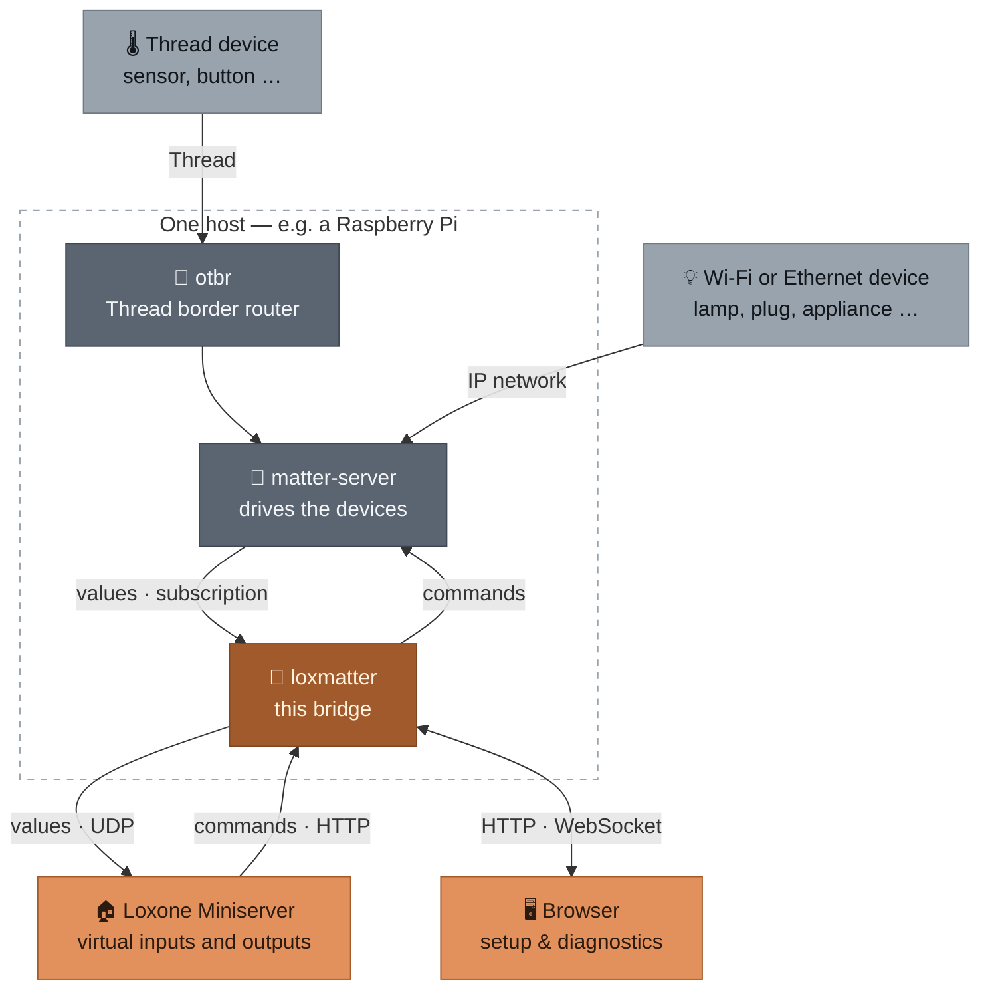

# README als Produktseite — Implementierungsplan

> **For agentic workers:** REQUIRED SUB-SKILL: Use superpowers:subagent-driven-development (recommended) or superpowers:executing-plans to implement this plan task-by-task. Steps use checkbox (`- [ ]`) syntax for tracking.

**Goal:** Aus der heutigen 404-zeiligen deutschen Handbuch-README eine englische Produktseite mit Screenshots machen und die Betriebsdetails nach `docs/` verschieben.

**Architecture:** Sieben Aufgaben in drei Wellen. Welle A (Aufgaben 1–2) baut die Screenshot-Infrastruktur: ein geseedetes Demo-Instanz-Skript und ein Playwright-Skript, das daraus sieben PNGs erzeugt. Welle B (Aufgaben 3–5) verschiebt und übersetzt die vier Detaildokumente — unabhängig von Welle A. Welle C (Aufgaben 6–7) schreibt die README neu und prüft am Ende Links, Warnhinweise und Vollständigkeit.

**Tech Stack:** Python 3.12, `uv`, FastAPI/uvicorn (bereits im Projekt), Playwright (nur als Ad-hoc-Abhängigkeit über `uv run --with`, **nicht** in `pyproject.toml`), Mermaid (von GitHub gerendert), Markdown.

**Entwurf:** [`docs/superpowers/specs/2026-09-05-readme-produktseite-design.md`](../specs/2026-09-05-readme-produktseite-design.md)

## Global Constraints

- **Nutzerseitige Dokumentation ist Englisch.** `README.md` und alles unter `docs/*.md` (nicht `docs/superpowers/`). Code-Kommentare, Commit-Nachrichten und `docs/superpowers/**` bleiben deutsch.
- **Schreibweise `Wi-Fi`**, nicht `WiFi`. Transporte werden immer als **Thread, Wi-Fi oder Ethernet** benannt — nie nur „Thread und WiFi". Begründung: die Design-Spec spricht unter „mDNS erreichbar" bereits von WLAN/Ethernet.
- **Diese acht Warnhinweise müssen erhalten bleiben** (Entwurf Abschnitt 6). Aufgabe 7 prüft jeden einzeln:
  1. Durchstich gegen einen echten Miniserver fehlt — Vorlagen nie in Loxone Config importiert.
  2. Kein TLS; Passwort und Token gehen im Klartext über das Netz.
  3. Trust on first use — Zeitfenster zwischen Start und erster Passwortvergabe.
  4. `/cmd` ist ein GET ohne Ursprungsprüfung, per `` von jeder Webseite auslösbar.
  5. Projektdatei-Sync: neue Geräte-Container experimentell, ID-Schema unverifiziert.
  6. `deploy/testhost/` ist kein gehärtetes Produktions-Image.
  7. Der Schema-Umzug setzt gesetzte Exportieren-Haken zurück.
  8. Ein Sprachwechsel wirkt nur auf **neu** erzeugte Vorlagen.
  Die Punkte 1, 2 und 3 stehen sichtbar in der README selbst, nicht nur verlinkt.
- **Keine Änderung an Anwendungscode, Verhalten oder bestehenden Tests.** Neue Dateien nur unter `scripts/`, `docs/` und `docs/screenshots/`.
- **Screenshots enthalten keine echten Daten** — nur Fixture-Geräte, Bridge-IP `192.168.1.50`, Miniserver `192.168.1.10`.
- **Quelltext der alten README:** bis Aufgabe 6 steht er in `README.md`. Danach: `git show 8002484:README.md`.

---

### Task 1: `--demo`-Betriebsart für den vorhandenen Dev-Server

**Files:**
- Modify: `scripts/dev_web_server.py`

**Interfaces:**
- Produces: die Schalter `--demo` und die unveränderte Vorgabe ohne ihn. Aufgabe 2 startet `uv run python scripts/dev_web_server.py --demo --port 8420` und erwartet den Dienst auf `http://127.0.0.1:8420/`, bereits mit vergebenem Passwort `loxmatter-demo` und hinterlegter Bridge-IP.

**Warum kein neues Skript:** `scripts/dev_web_server.py` macht bereits das Schwierige — Fixtures laden, Geräte registrieren, `build_app` ohne Matter-Client aufrufen, servieren. Vor allem enthält es `_SeededRuntime`: rund 40 Zeilen dokumentiertes Duck-Typing, das `_RuntimeDependency` erfüllt und den Gerätekarten überhaupt erst Werte gibt. Ein zweites Skript müsste das kopieren, und die Kopie würde driften.

**Was fehlt** für automatisierte Screenshots: ein vorab gesetztes Passwort (sonst steht die Ersteinrichtung im Bild), hinterlegte Bridge-Einstellungen (sonst blockiert der Export-Tab mit „Brücken-IP zuerst hinterlegen"), englische Gerätenamen und mehr als zwei Geräte.

- [ ] **Step 1: Die Datei lesen**

```bash
cat scripts/dev_web_server.py
```

Wichtig sind `_load_snapshot`, `_ensure_devices`, `_seed_values`, `_SeededRuntime` und `_parse_args`. Der Code unten baut darauf auf und ersetzt nichts davon.

- [ ] **Step 2: Import und Demo-Daten ergänzen**

Zu den vorhandenen Importen:

```python
from loxmatter.auth.passwords import hash_password
```

Nach der `FIXTURES`-Zeile:

```python
DEMO_PASSWORD = "loxmatter-demo"

# Reihenfolge bestimmt die Reihenfolge in der Geraeteliste - die Steckdose
# zuerst, weil ihre Signalliste den Unterschied funktional/Experte am besten
# zeigt (ueber hundert Signale, davon eine Handvoll funktional).
DEMO_DEVICES = [
    ("ikea_grillplats_plug.json", "Coffee machine"),
    ("example_light.json", "Living room lamp"),
    ("synthetic_color_light.json", "Kitchen spots"),
    ("ikea_bilresa_button.json", "Hallway button"),
]


def _ensure_demo_devices(store: Store) -> list[int]:
    """Wie `_ensure_devices`, aber vier Geraete mit englischen Namen: die
    README-Screenshots zeigen eine englische Oberflaeche, deutsche
    Geraetenamen darin saehen nach Versehen aus."""
    if store.devices():
        return [device.id for device in store.devices()]

    device_ids: list[int] = []
    for filename, label in DEMO_DEVICES:
        snapshot = _load_snapshot(filename)
        device_id = store.register_device(snapshot)
        store.register_signals(device_id, snapshot)
        store.register_commands(device_id, extract_commands(snapshot), snapshot.node_id)
        store.rename_device(device_id, label)
        device_ids.append(device_id)

    # Ein Geraet gilt als bereits exportiert, damit die Export-Vorschau beide
    # Faelle nebeneinander zeigt statt vier gleich aussehender Zeilen.
    store.mark_exported(device_ids[0])
    return device_ids
```

- [ ] **Step 3: Den Schalter einhängen**

In `_parse_args` den Vorgabewert von `--store-path` auf `None` umstellen und `--demo` ergänzen:

```python
    parser.add_argument(
        "--store-path",
        type=Path,
        default=None,
        help="Datenbankdatei (Default: eine feste Datei im Temp-Verzeichnis).",
    )
    parser.add_argument("--port", type=int, default=8420)
    parser.add_argument(
        "--demo",
        action="store_true",
        help=(
            "Vier Geraete mit englischen Namen, Passwort und Bridge-Einstellungen "
            "vorbelegt, Datenbank bei jedem Start frisch - fuer die README-Screenshots."
        ),
    )
```

`main()` wird zu:

```python
def main() -> None:
    args = _parse_args()

    # Eigene Datenbankdatei fuer den Demo-Betrieb, und die faellt bei jedem
    # Start neu an: nur so entstehen aus demselben Aufruf zweimal dieselben
    # Screenshots. Der normale Entwicklungsbetrieb behaelt seinen Bestand.
    default_name = "loxmatter-demo-web.sqlite" if args.demo else "loxmatter-dev-web.sqlite"
    store_path = args.store_path or Path(tempfile.gettempdir()) / default_name
    if args.demo and args.store_path is None:
        store_path.unlink(missing_ok=True)

    store = Store(store_path)
    if args.demo:
        store.auth.reset_password(hash_password(DEMO_PASSWORD))
        store.settings.save(bridge_ip="192.168.1.50", udp_port=7000, listen_port=8080)
        device_ids = _ensure_demo_devices(store)
    else:
        device_ids = _ensure_devices(store)

    values = _seed_values(store, device_ids)
    runtime = _SeededRuntime(values)
    app = build_app(store, _invoke, runtime)
    print(f"Datenbank: {store_path}")
    print(f"WebUI: http://127.0.0.1:{args.port}")
    uvicorn.run(app, host="127.0.0.1", port=args.port)
```

- [ ] **Step 4: Beide Betriebsarten prüfen**

```bash
uv run python scripts/dev_web_server.py --demo --port 8420 &
sleep 4
curl -s -o /dev/null -w "start=%{http_code}\n" http://127.0.0.1:8420/
curl -s http://127.0.0.1:8420/auth-info
kill %1
```

Erwartet: `start=200`, und `/auth-info` antwortet mit `{"password_set":true,"authenticated":false}` — also nicht mit der Ersteinrichtung. Der Pfad hat **kein** `/api`-Präfix: die Zugangs-Routen hängen bewusst ausserhalb des Waechters, sonst käme man vor der ersten Anmeldung nirgends hin (siehe `src/loxmatter/api/auth.py`, Moduldocstring).

Danach die unveränderte Vorgabe:

```bash
uv run python scripts/dev_web_server.py --port 8421 &
sleep 4
curl -s -o /dev/null -w "start=%{http_code}\n" http://127.0.0.1:8421/
kill %1
```

Erwartet: `start=200` und weiterhin die Ersteinrichtung — ohne `--demo` darf sich nichts geändert haben.

- [ ] **Step 5: Commit**

```bash
git add scripts/dev_web_server.py
git commit -m "docs(screenshots): --demo-Betriebsart fuer den Dev-Server"
```

---

### Task 2: Die sieben Screenshots erzeugen

**Files:**
- Create: `scripts/capture_screenshots.py`
- Create: `docs/screenshots/dashboard.png`, `commissioning.png`, `signals.png`, `export.png`, `project-sync.png`, `system.png`, `settings.png`

**Interfaces:**
- Consumes: `scripts/dev_web_server.py --demo` aus Aufgabe 1 (als Unterprozess auf Port 8420, Passwort `loxmatter-demo`, Bridge-IP bereits hinterlegt).
- Produces: sieben PNGs unter `docs/screenshots/`, auf die Aufgabe 6 mit `` verweist.

- [ ] **Step 1: Selektoren aus dem Markup holen, nicht erfinden**

Die Oberfläche hat sich in einer Woche dreimal geändert. Vor dem Schreiben die echten Aufhänger suchen:

```bash
grep -n "password\|login\|setup" src/loxmatter/web/index.html | head -20
grep -n "selectView(" src/loxmatter/web/index.html | head -10
grep -n 'x-show="view ===' src/loxmatter/web/index.html
grep -n "projectSync\|uploadProjectFile" src/loxmatter/web/index.html | head -5
```

Die Ansichten heißen `devices`, `signals`, `export`, `system`, `settings` und werden über `selectView('<name>')` umgeschaltet. Der Login ist ein Passwortfeld plus Knopf; die genauen Attribute stehen im Markup.

- [ ] **Step 2: Playwright bereitstellen**

```bash
uv run --with playwright python -m playwright install chromium
```

Erwartet: Download endet mit „Chromium … downloaded to …". Playwright kommt **nicht** in `pyproject.toml` — es wird nur zum Neuerzeugen der Bilder gebraucht.

- [ ] **Step 3: Das Aufnahmeskript schreiben**

Selektoren aus Step 1 einsetzen, wo unten `# aus Step 1` steht.

```python
"""Fotografiert die Oberflaeche fuer die README ab.

Aufruf:  uv run --with playwright python scripts/capture_screenshots.py

Startet `dev_web_server.py --demo` selbst, meldet sich an, klappert die
Ansichten ab und legt die Bilder unter docs/screenshots/ ab. Zweimal
aufgerufen entstehen dieselben Bilder - die Demo-Datenbank faellt bei jedem
Start neu an (siehe dort).
"""

from __future__ import annotations

import subprocess
import sys
import time
from pathlib import Path

from playwright.sync_api import Page, sync_playwright

ROOT = Path(__file__).resolve().parents[1]
SHOTS = ROOT / "docs" / "screenshots"
PORT = 8420
BASE = f"http://127.0.0.1:{PORT}"
PASSWORD = "loxmatter-demo"


def shoot(page: Page, name: str) -> None:
    page.wait_for_timeout(600)          # Alpine rendert nach dem Laden nach
    SHOTS.mkdir(parents=True, exist_ok=True)
    page.screenshot(path=str(SHOTS / f"{name}.png"))
    print(f"  {name}.png")


def capture(page: Page) -> None:
    page.goto(BASE, wait_until="networkidle")
    page.fill('input[type="password"]', PASSWORD)      # aus Step 1
    page.click('button:has-text("Sign in")')            # aus Step 1
    page.wait_for_timeout(1200)

    shoot(page, "dashboard")

    page.evaluate("document.querySelector('[x-data]')._x_dataStack[0].selectView('signals')")
    shoot(page, "signals")

    page.evaluate("document.querySelector('[x-data]')._x_dataStack[0].selectView('export')")
    shoot(page, "export")

    page.evaluate("document.querySelector('[x-data]')._x_dataStack[0].selectView('system')")
    shoot(page, "system")

    page.evaluate("document.querySelector('[x-data]')._x_dataStack[0].selectView('settings')")
    shoot(page, "settings")


def main() -> int:
    server = subprocess.Popen(
        [
            sys.executable,
            str(ROOT / "scripts" / "dev_web_server.py"),
            "--demo",
            "--port",
            str(PORT),
        ]
    )
    try:
        time.sleep(4)
        with sync_playwright() as pw:
            browser = pw.chromium.launch()
            page = browser.new_page(viewport={"width": 1440, "height": 960}, device_scale_factor=2)
            capture(page)
            browser.close()
    finally:
        server.terminate()
        server.wait(timeout=10)
    return 0


if __name__ == "__main__":
    raise SystemExit(main())
```

Der `page.evaluate`-Umweg über Alpines Datenstapel ist absichtlich: ein Klick auf den Reiter wäre schöner, hängt aber am genauen Markup der Navigation. Klappt der Klick über `page.click('nav.tabs button:has-text("Signals")')`, ist das die bessere Fassung — dann diese verwenden.

- [ ] **Step 4: Die beiden Sonderfälle ergänzen**

`commissioning.png` und `project-sync.png` brauchen mehr als einen Reiterwechsel.

Für `commissioning.png`: die Einlern-Karte steht oben im Geräte-Tab. Einen Beispielcode eintragen, **ohne** abzuschicken (ohne Matter-Verbindung käme nur ein Fehler), dann fotografieren:

```python
    page.evaluate("document.querySelector('[x-data]')._x_dataStack[0].selectView('devices')")
    page.fill('input[placeholder*="MT:"]', "MT:Y.K9042C00KA0648G00")   # Selektor aus Step 1
    shoot(page, "commissioning")
```

Für `project-sync.png`: die Beispiel-Projektdatei aus den Tests hochladen und den Diff-Plan abwarten:

```python
    from tests.projectsync.conftest import SAMPLE_PROJECT     # oben importieren

    sample = ROOT / "docs" / "screenshots" / "_sample.Loxone"
    sample.write_text(SAMPLE_PROJECT, encoding="utf-8")
    page.evaluate("document.querySelector('[x-data]')._x_dataStack[0].selectView('export')")
    page.set_input_files('input[type="file"]', str(sample))
    page.wait_for_timeout(2500)          # Upload plus Diff-Berechnung
    shoot(page, "project-sync")
    sample.unlink()
```

Damit `from tests…` importierbar ist, muss `ROOT` in `sys.path` liegen:

```python
sys.path.insert(0, str(ROOT))
```

- [ ] **Step 5: Laufen lassen und die Bilder ansehen**

```bash
uv run --with playwright python scripts/capture_screenshots.py
ls -la docs/screenshots/
```

Erwartet: sieben PNGs, jede deutlich über 40 KB. Eine Datei unter 20 KB ist fast immer eine leere oder noch nicht gerenderte Ansicht.

**Dann jedes Bild wirklich ansehen** (Read-Tool auf die PNG-Datei). Prüfen: keine leeren Zustände, kein Anmeldebildschirm, wo Inhalt sein soll, keine sichtbaren Fehlermeldungen, `_sample.Loxone` wieder gelöscht. Ein Bild, das eine Fehlermeldung zeigt, ist ein Fehlschlag der Aufgabe, kein Schönheitsfehler.

- [ ] **Step 6: Commit**

```bash
git add scripts/capture_screenshots.py docs/screenshots/
git commit -m "docs(screenshots): sieben Aufnahmen der Oberflaeche samt Aufnahmeskript"
```

---

### Task 3: `docs/SETUP.md`

**Files:**
- Create: `docs/SETUP.md`
- Read: `README.md` Zeilen 84–171 und 182–193

**Interfaces:**
- Produces: `docs/SETUP.md` mit den Ankern `#requirements`, `#try-it-without-hardware`, `#your-own-setup`, `#looking-at-a-device`. Aufgabe 6 verlinkt darauf.

- [ ] **Step 1: Übersetzen und zusammenstellen**

Quelle sind drei Abschnitte der alten README, in dieser Reihenfolge: „Voraussetzungen" (84–109), „Erste Schritte" mit beiden Unterabschnitten (111–171), „Ein Gerät ansehen" (182–193).

Abschnitt für Abschnitt übersetzen, nicht frei nacherzählen. Erhalten bleiben müssen:

- Die vollständige Hardware-Liste inklusive Thread-Funkmodul und Bluetooth-Adapter.
- Der Satz, dass kein Vorwissen über Matter oder Thread nötig ist.
- **Warnhinweis 6:** der Blockquote, dass `deploy/testhost/` kein gehärtetes Produktions-Image ist (nicht-root, gepinnte Digests offen).
- Alle Codeblöcke unverändert — Befehle werden nicht übersetzt.
- Alle Links nach `deploy/testhost/`, angepasst auf die neue Tiefe: aus `deploy/testhost/` wird `../deploy/testhost/`.

Kopfzeile:

```markdown
# Setup

[Back to the README](../README.md)
```

Transporte durchgängig als „Thread, Wi-Fi or Ethernet" benennen (Global Constraints).

**Kein Diagramm in dieser Datei.** Das vollständige Architekturdiagramm steht in der README (Aufgabe 6) — dieselbe Zeichnung ein zweites Mal hier wäre Redundanz, die beim nächsten Umbau auseinanderläuft. Stattdessen an der Stelle, an der die Docker-Container erklärt werden, ein Verweis:

```markdown
See [how the pieces fit together](../README.md#-how-it-works) for what each of the three
containers does.
```

- [ ] **Step 2: Links prüfen**

```bash
grep -oE '\]\([^)#][^)]*\)' docs/SETUP.md | tr -d ']()' | while read -r p; do
  [ -e "docs/$p" ] || [ -e "$p" ] || echo "TOT: $p"
done
```

Erwartet: keine Ausgabe.

- [ ] **Step 3: Commit**

```bash
git add docs/SETUP.md
git commit -m "docs(setup): Voraussetzungen und Erste Schritte nach docs/SETUP.md, englisch"
```

---

### Task 4: `docs/OPERATIONS.md`

**Files:**
- Create: `docs/OPERATIONS.md`
- Read: `README.md` Zeilen 195–360

**Interfaces:**
- Produces: `docs/OPERATIONS.md` mit den Ankern `#running-the-bridge`, `#what-a-template-contains`, `#project-file-sync`, `#access-control`, `#language`. Aufgabe 6 verlinkt darauf.

Das ist der größte Übersetzungsblock: 165 Zeilen dichte Prosa, davon der halbe Abschnitt „Zugangsschutz" mit sicherheitsrelevanten Aussagen. Nichts davon zusammenfassen.

- [ ] **Step 1: Übersetzen**

Quelle in dieser Reihenfolge: „Dauerhaft betreiben: `loxmatter run`" (195–258), „Zugangsschutz" (260–337), „Sprache: Englisch oder Deutsch" (339–360).

Diese Aussagen müssen wörtlich in der Sache erhalten bleiben — sie sind der Grund, warum dieses Dokument existiert:

- **Warnhinweis 2 (kein TLS):** Passwort und Token gehen im Klartext; ein **zufällig erzeugtes** Passwort verwenden, das nirgendwo sonst benutzt wird.
- **Warnhinweis 3 (Trust on first use):** wer zuerst kommt, vergibt das Passwort; das Zeitfenster soll Minuten dauern, nicht Tage.
- **Warnhinweis 4 (`/cmd`):** GET ohne Ursprungsprüfung, per `` von jeder Webseite auslösbar, die jemand aus dem Netz öffnet — ein Fuß im LAN ist dafür nicht nötig.
- **Warnhinweis 5 (Projektdatei-Sync):** neue Geräte-Container sind experimentell, das ID-Schema stammt aus einer einzigen echten Projektdatei, ist nicht offiziell dokumentiert und **nicht verifiziert**; vor dem ersten Vertrauen eine gepatchte Datei in Loxone Config öffnen und prüfen.
- **Warnhinweis 7 (Schema-Umzug):** setzt den Exportieren-Haken **jedes** gespeicherten Signals auf den Vorgabewert zurück, ohne Warnung.
- **Warnhinweis 8 (Sprachwechsel):** wirkt nur auf **neu** erzeugte Vorlagen.
- Die `set-password`-Falle bei containerisierter Installation (Datenbank im Volume, `set-password` auf dem Host träfe eine andere, leere Datenbank — der Befehl bricht deshalb ab).
- Die Token-Anforderungen: keine Leerzeichen, kein Komma, kein Nicht-ASCII; `openssl rand -hex 32`; ein Token aus reinem Leerraum gilt als nicht gesetzt.
- Dass `/cmd` und `/resync` bewusst immer offen bleiben, weil der Miniserver keinen Header mitschicken kann.

Kopfzeile:

```markdown
# Running loxmatter

[Back to the README](../README.md)
```

Links auf `docs/superpowers/specs/…` werden zu `superpowers/specs/…`, Links auf `deploy/testhost/…` zu `../deploy/testhost/…`.

- [ ] **Step 2: Warnhinweise gegenprüfen**

Nach dem Schreiben jeden der sechs oben genannten Punkte im fertigen Dokument suchen und abhaken. Fehlt einer, ist die Aufgabe nicht fertig.

- [ ] **Step 3: Links prüfen**

```bash
grep -oE '\]\([^)#][^)]*\)' docs/OPERATIONS.md | tr -d ']()' | while read -r p; do
  [ -e "docs/$p" ] || [ -e "$p" ] || echo "TOT: $p"
done
```

Erwartet: keine Ausgabe.

- [ ] **Step 4: Commit**

```bash
git add docs/OPERATIONS.md
git commit -m "docs(operations): Betrieb, Zugangsschutz und Sprache nach docs/OPERATIONS.md, englisch"
```

---

### Task 5: `docs/DEVELOPMENT.md` und `docs/LICENSING.md`

**Files:**
- Create: `docs/DEVELOPMENT.md`
- Create: `docs/LICENSING.md`
- Read: `README.md` Zeilen 173–180 und 376–404

Beide sind kurz und werden zusammen erledigt — sie teilen sich einen Commit, weil keiner von beiden für sich einen Review-Durchgang wert ist.

- [ ] **Step 1: `docs/DEVELOPMENT.md` schreiben**

Quelle: „Entwickeln" (173–180). Der Abschnitt ist acht Zeilen lang; er darf um die Dinge ergänzt werden, die im Repository nachweislich gelten und ein Beitragender sofort braucht:

```markdown
# Development

[Back to the README](../README.md)

```bash
uv sync
uv run pytest
```

The test suite runs without hardware and without network access.

## Checks that CI runs

```bash
uv run ruff check src tests
uv run ruff format --check src tests
uv run mypy src
```
```

Vor dem Übernehmen prüfen, dass diese drei Befehle wirklich die sind, die CI ausführt:

```bash
cat .github/workflows/ci.yml
```

Weicht CI ab, gilt CI.

- [ ] **Step 2: `docs/LICENSING.md` schreiben**

Quelle: „Fremdsoftware" (376–393) und „Hinweise in den Quelldateien" (395–404). Die Tabelle der Abhängigkeiten mit ihren Lizenzen bleibt vollständig, ebenso die beiden Begründungen: dass Apache-2.0 einseitig mit GPL-3.0 vereinbar ist, und dass der GPL-Hinweis in den Quelldateien bewusst in der englischen Fassung der FSF steht.

Kopfzeile wie oben, Überschrift `# Licensing`.

- [ ] **Step 3: Commit**

```bash
git add docs/DEVELOPMENT.md docs/LICENSING.md
git commit -m "docs: Entwickeln und Lizenzdetails nach docs/, englisch"
```

---

### Task 6: Die neue README

**Files:**
- Modify: `README.md` — vollständig ersetzt
- Read: `docs/screenshots/` (aus Aufgabe 2), `docs/SETUP.md`, `docs/OPERATIONS.md`, `docs/DEVELOPMENT.md`, `docs/LICENSING.md`

**Interfaces:**
- Consumes: die sieben PNGs aus Aufgabe 2 und die vier Dokumente aus Aufgaben 3–5.

- [ ] **Step 1: Hero, Badges, Sprungmarken**

```markdown
<div align="center">


# loxmatter

### Matter devices in Loxone — self-hosted, no cloud

Your Miniserver does not speak Matter. This bridge makes it anyway: every value a
Matter device reports becomes a virtual input, every Loxone command becomes a Matter
command, and the Loxone objects for it are generated rather than typed by hand.


[](https://github.com/lucienkerl/loxmatter/actions/workflows/ci.yml)

[What it does](#-what-you-can-do) · [Screenshots](#-the-web-interface) ·
[How it works](#-how-it-works) · [Quickstart](#-quickstart) · [Docs](#-documentation)

</div>
```

Vor dem Übernehmen den CI-Badge prüfen — Datei- und Job-Name müssen zu `.github/workflows/ci.yml` passen.

- [ ] **Step 2: „Why loxmatter" und die Feature-Tabelle**

```markdown
## Why loxmatter

Loxone has no Matter support, and Matter devices have no idea what a Miniserver is.
The usual answer is a cloud bridge per vendor. This is the other answer: one service
on your own hardware that reads devices generically — no curated list of supported
models, so a device bought tomorrow works today — and hands Loxone something it already
understands.

## ✨ What you can do

<table>
<tr>
<td width="50%" valign="top">

### 📟 Commission devices from the browser
Add a Matter device over Bluetooth with its setup code. Thread devices reach the
bridge through the border router in the same stack; Wi-Fi and Ethernet devices go
straight over IP.

</td>
<td width="50%" valign="top">

### 🎛 Pick the signals you actually want
A single plug can expose over a hundred values. The functional ones are selected by
default; everything else waits in a collapsed “expert” block with its own checkbox.

</td>
</tr>
<tr>
<td width="50%" valign="top">

### 📄 Generate the Loxone objects
Virtual UDP inputs and virtual outputs come out as importable template files, one
pair per device, instead of being typed into Loxone Config by hand.

</td>
<td width="50%" valign="top">

### 🔁 Patch your existing project file
Upload the Loxone project you already have, see exactly what would change per device
and per signal, download the patched copy. Nothing is downloaded before you have seen
the plan.

</td>
</tr>
<tr>
<td width="50%" valign="top">

### 🔍 Watch it work
A live feed of log lines, outgoing datagrams and incoming commands — the same lines
`docker logs` would show, without shell access to the host.

</td>
<td width="50%" valign="top">

### 🔒 Locked down by default, in your language
No `/api` route answers before a password is set. The interface speaks English or
German, switchable in the settings, and the setting applies to the CLI too.

</td>
</tr>
</table>
```

- [ ] **Step 3: Screenshots und Architektur**

Galerie aus den sieben Bildern, zwei je Reihe, im selben `<table>`-Muster wie oben, jeweils `.png" alt="…">` mit fetter Bildunterschrift und einer erklärenden Zeile. Reihenfolge: dashboard · commissioning, signals · export, project-sync · system, settings allein in der letzten Reihe.

Danach der Architekturabschnitt. Dieser Mermaid-Block ist die abgestimmte Fassung (Variante 1) und wird **wörtlich** übernommen — kein `%%{init}%%`-Theme, sonst bricht GitHubs Dark Mode:

````markdown
## 🏗 How it works


````

Darunter ein Absatz zum Datenfluss: `matter-server` hält die Fabric und liefert Werte per Subscription; loxmatter übersetzt sie in Datagramme an den Miniserver und Loxone-Befehle zurück in Matter-Kommandos; der Browser hängt nur für Einrichtung und Diagnose daran.

- [ ] **Step 4: Quickstart, Status, Dokumentation, Schluss**

Quickstart — drei Schritte, kompakt, mit dem Hinweis, dass der vollständige Weg in `docs/SETUP.md` steht:

````markdown
## 🚀 Quickstart

Try it without any hardware:

```bash
git clone git@github.com:lucienkerl/loxmatter.git
cd loxmatter
uv sync
uv run loxmatter inspect --fixture tests/fixtures/nodes/example_light.json
```

For a real setup — Docker stack with `otbr`, `matter-server` and the bridge — follow
[docs/SETUP.md](docs/SETUP.md).
````

Danach der Status-Abschnitt. Er trägt die Warnhinweise 1, 2 und 3 sichtbar, nicht nur verlinkt:

```markdown
## 🗺 Status

Working and validated against two real IKEA devices on a running `matter-server`:
commissioning, signal extraction, the template export, the runtime path in both
directions, the web interface and its access control.

**Not yet done: the run against a real Miniserver.** The generated templates have only
been checked against a rebuilt Miniserver, never imported into Loxone Config.

**No TLS.** The service speaks plain HTTP — the password and any API token cross the
network in the clear. Use a randomly generated password that is used nowhere else.

**First come, first served.** Until a password is set, anyone who can reach the port
can claim the bridge. Set it within minutes of the first start, not days.
```

Dokumentationstabelle mit vier Zeilen (`docs/SETUP.md`, `docs/OPERATIONS.md`, `docs/DEVELOPMENT.md`, `docs/LICENSING.md`), je eine Zeile Beschreibung. Danach ein kurzer Tech-Stack-Block, ein zweizeiliger Contributing-Absatz und der Lizenzabschnitt: GPL-3.0-or-later, ein Satz was das praktisch heißt, Link auf `LICENSE` und auf `docs/LICENSING.md`.

- [ ] **Step 5: Ansehen, bevor committet wird**

```bash
wc -l README.md
grep -c '!\[\| /tmp/readme-alt.md
grep -n '^#' /tmp/readme-alt.md
```

Für jede Überschrift der alten README benennen, wo ihr Inhalt jetzt lebt. Erwartete Zuordnung: Was macht loxmatter → README „Why" plus Diagramm; Stand → README „Status"; Voraussetzungen, Erste Schritte, Ein Gerät ansehen → `SETUP.md`; Entwickeln → `DEVELOPMENT.md`; Dauerhaft betreiben, Zugangsschutz, Sprache → `OPERATIONS.md`; Lizenz → README plus `LICENSING.md`; Fremdsoftware, Hinweise in den Quelldateien → `LICENSING.md`. Etwas ohne neues Zuhause ist ein Fund.

- [ ] **Step 4: Testsuite als Regressionsschutz**

```bash
uv run pytest -q
```

Erwartet: unverändert grün. Diese Arbeit fasst keinen Anwendungscode an — schlägt etwas fehl, kommt es nicht von hier, aber es wird trotzdem gemeldet.

- [ ] **Step 5: Commit, falls Step 1–3 etwas gefunden haben**

```bash
git add -A
git commit -m "docs: Funde aus der Abnahme nachgezogen"
```

---

## Selbstprüfung des Plans

**Abdeckung gegen den Entwurf:** Abschnitt 3 (README-Aufbau) → Aufgabe 6. Abschnitt 4 (docs/-Aufteilung) → Aufgaben 3–5. Abschnitt 5 (Screenshots) → Aufgaben 1–2. Abschnitt 6 (Warnhinweise) → Global Constraints plus Aufgabe 7, Step 2. Abschnitt 7 (Abgrenzung) → Global Constraints. Abschnitt 8 (Risiken) → Aufgabe 7, Steps 1–3.

**Bewusst offen gelassen:** Der Quickstart beschreibt die manuelle Installation. Das One-Liner-Skript entsteht in einer eigenen Session und zieht Aufgabe 6, Step 4 nach.

**Bekannte Schwachstelle:** Die Selektoren in Aufgabe 2 (Login-Feld, Einlern-Codefeld, Datei-Eingabe) sind aus dem heutigen Markup abgeleitet und stehen deshalb unter dem ausdrücklichen Vorbehalt aus Step 1 — erst greppen, dann schreiben. Das ist die Stelle, an der diese Arbeit am ehesten bricht.

**Beim Schreiben des Plans korrigiert:**

- Aufgabe 1 hieß zuerst „neues Skript `scripts/demo_instance.py`". Beim Prüfen der Signaturen kam `scripts/dev_web_server.py` zum Vorschein, das dasselbe bereits tut — inklusive `_SeededRuntime`, ohne das die Gerätekarten in den Screenshots nur Striche zeigen würden. Aus dem neuen Skript wurde eine `--demo`-Betriebsart des vorhandenen.
- Der erste Entwurf importierte `MatterCall` aus `loxmatter.matter.models`; es lebt in `loxmatter.commands.translate`. Erledigt sich mit der Umstellung auf `dev_web_server.py`, das den Import bereits richtig hat.
- `docs/SETUP.md` sollte das Architekturdiagramm wiederholen. Mit Variante 1 in der README wäre das dieselbe Zeichnung zweimal — jetzt ein Verweis.
